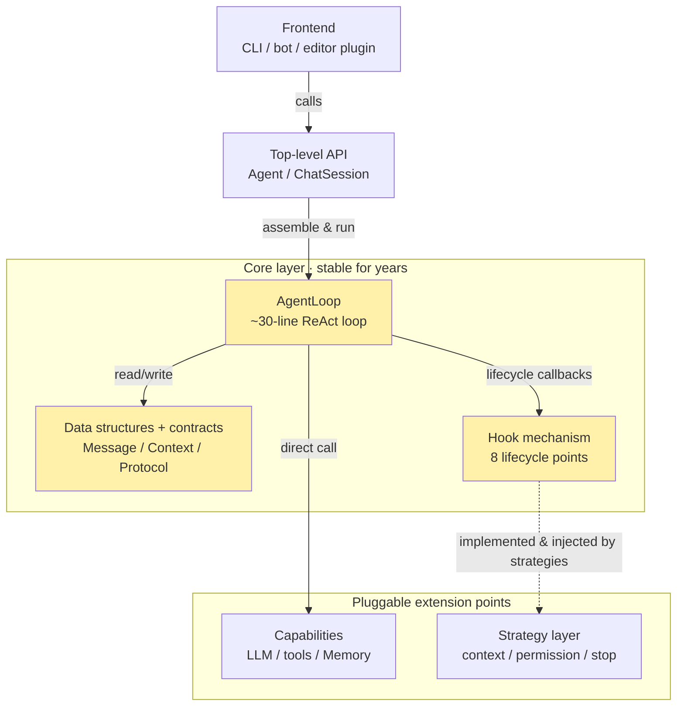

# nanoagent

**English** · [中文](README.zh-CN.md)

> A **single-agent ReAct framework** whose core loop is only ~30 lines, yet evolves into a genuinely usable runtime by introducing harness engineering practices in stages. It makes an agent's internals readable *and* lets you build your own agent app on top.

> **Status: v0.1 baseline implemented.** Core loop / tool system / LLM client (OpenAI-compatible, incl. DeepSeek) / in-memory memory / default strategies / CLI are all in place; `python -m pytest` → 61 passed (fully offline). **Installable from source today** (see [Quick start](#quick-start)); PyPI release imminent — then `pip install pynanoagent` (the dist name carries a `py` prefix; you still `import nanoagent`). Design doc (in Chinese): [`docs/DESIGN.md`](docs/DESIGN.md).

## What is this

In 2026 the agent-framework landscape has a structural gap: **orchestration frameworks** (LangGraph / CrewAI) get an agent running, but context management, permissions and observability are usually bolted on later — complex, with fuzzy boundaries; **product-grade agents** (Claude Code / Cursor) have mature harnesses but are closed-source, model-locked and not reusable. An open framework that is *both* readable layer-by-layer *and* genuinely usable is largely missing.

nanoagent fills that gap, with three non-negotiable keywords:

- **Easy to understand** — the core layer is small and low-abstraction; you can read `core/loop.py` in an hour or two and truly grasp what each turn does.
- **Best practices, staged** — context engineering, permission checks, circuit breaking, layered memory, skill systems and other community-proven practices, introduced in stages, each with a rationale.
- **Genuinely usable** — not a toy: by v0.4 it should sustain long-running tasks without falling over.

## Core design principle: Stable Core + Pluggable Strategy

The whole project bets on one split: a **core layer** (the parts unchanged for the past five years and unlikely to change for years — LLM calls, the loop, tool dispatch, data structures) vs a **strategy layer** (the parts that evolve with best practices — how to manage context, check permissions, break circuits). Once the core is finalized it stops changing; adopting a new best practice = adding one implementation in the strategy layer, with the core untouched.

The diagram answers: "Which layers make up nanoagent, and how do they call each other at runtime?"



**How to read it:** the three amber boxes are the core layer, fixed for years. Note the asymmetry of the two dependency directions — `AgentLoop` **directly calls** capabilities (LLM / tools / Memory are necessities for the loop to run — solid lines), but only **reaches the strategy layer indirectly via Hooks** (dashed: a strategy implements a Hook protocol and is injected at some lifecycle point). The test is simple: remove the capability layer and the loop can't run; remove the strategy layer and it still runs (degrading to plain ReAct). The core thus knows nothing about compaction or permission — it only knows "call a set of hooks at a given point." That is the physical mechanism that makes "stable core, pluggable strategy" hold.

## Roadmap

| Version | Scope | Status |
|---|---|---|
| **v0.1 · Core** | single agent + tool system + in-memory memory + CLI demo | ✅ baseline done (runs from source, 61 tests pass) |
| v0.2 · Skills + Trace + MCP | progressive Skill loading + OpenTelemetry trace + filesystem memory + MCP tool adapter | 📋 planned |
| v0.3 · Harness | multi-strategy context management + permission system + circuit breaker + subagent | 📋 planned |
| v0.4 · Eval | three-dimension evaluation framework (separate repo) | 📋 planned |

## Quick start

Install from source for now (after PyPI release: `pip install pynanoagent`; the import name stays `nanoagent`):

```bash
git clone https://github.com/eastonsuo/nanoagent && cd nanoagent
pip install -e .
```

**CLI chat** (needs an OpenAI-compatible key):

```bash
export OPENAI_API_KEY=sk-...          # OpenAI
nanoagent
```

Switch to **DeepSeek** or another compatible endpoint — the model-name prefix auto-selects the endpoint, just give the matching key (no base_url needed):

```bash
export DEEPSEEK_API_KEY=sk-...        # DeepSeek (falls back to OPENAI_API_KEY)
export NANOAGENT_MODEL=deepseek-chat
nanoagent
```

**As a library** — register tools with `@tool`; one-shot tasks use `Agent.run`, multi-turn chat uses `Agent(...).session()`:

```python
from nanoagent import Agent, tool

@tool
def word_count(path: str) -> int:
    """Count the words in a text file."""
    return len(open(path).read().split())

agent = Agent("gpt-4o-mini", tools=[word_count])
print(agent.run("How many words are in README.md?").output)   # one-shot, no memory across runs

chat = agent.session()                                          # multi-turn, remembers context
chat.send("My name is Alice")
print(chat.send("What's my name?").output)
```

## What's implemented in v0.1

| Layer | Modules | Content |
|---|---|---|
| Core · stable for years | `core/` | data structures + capability/strategy contracts + 8 Hook points + `AgentLoop` (~30-line ReAct loop) |
| Capabilities | `tools/` `llm/` `memory/` | `@tool` + auto schema generation; OpenAI-compatible client (+ echo for tests); in-memory memory |
| Strategy · pluggable | `strategies/` | default noop / allow-all / max-turns + wrapping a strategy as a Hook |
| Entry / assembly | `api.py` `cli/` | `Agent` / `ChatSession` + CLI REPL |

- **Readability:** the core layer (excluding `__init__`) is ~390 lines, under 500.
- **Tests:** `python -m pytest` → 61 passed, fully offline, no API key needed (an echo client drives the whole chain).
- **Dependency guard:** `core/` imports nothing from outer layers — the physical guarantee of "stable core" (design §8.1).
- **OpenAI-compatible:** OpenAI / DeepSeek / Kimi / vLLM / Ollama — just change the model name or endpoint.

## Docs

- [`docs/DESIGN.md`](docs/DESIGN.md) — the authoritative design doc (14 chapters, in Chinese): concepts & design philosophy, core/harness decoupling, core data structures & interface contracts, overall architecture, v0.1 detailed design, tech choices, comparison with existing frameworks, risks. **It is the source of truth for implementation details.**

## License

[MIT License](LICENSE).
