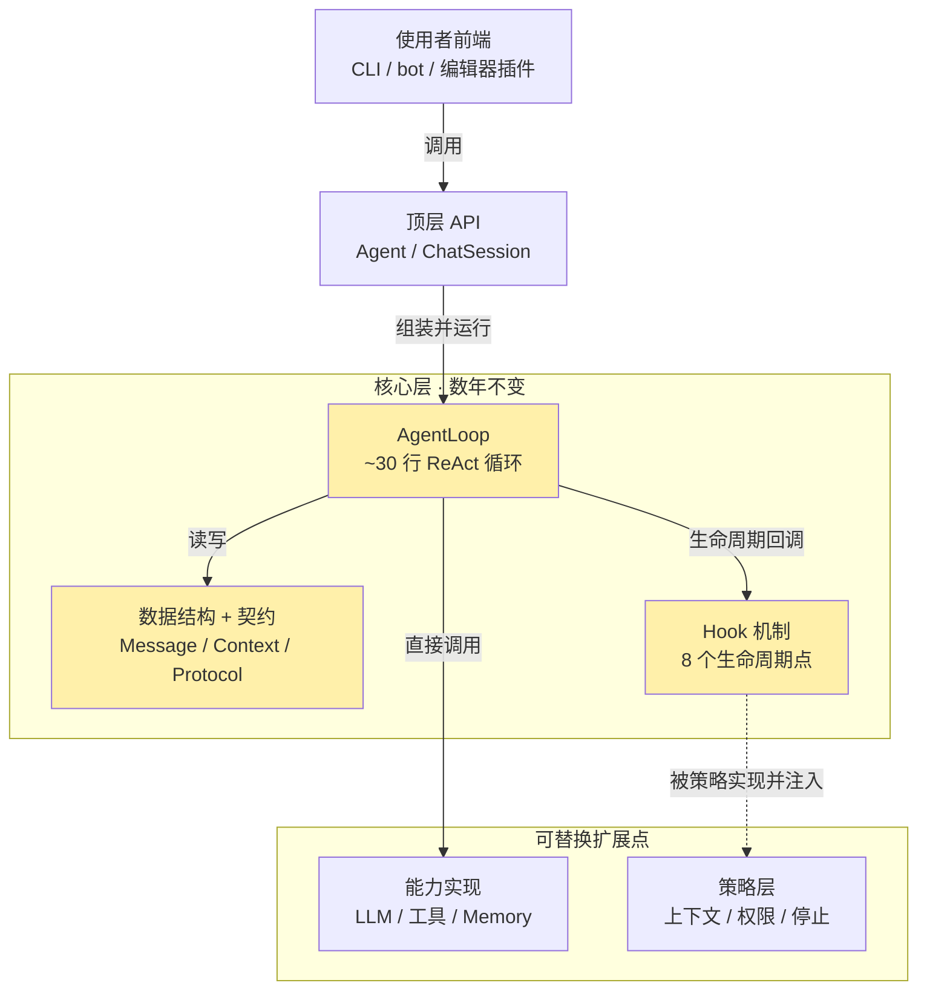

# nanoagent

> 一个核心循环只有约 30 行、却能通过分阶段引入 harness 工程实践演进为真实可用运行时的 **ReAct 单 agent 框架**。既把 agent 的内部机制讲清楚，也让人能基于它构建自己的 agent 应用。

> ⚠️ **状态：v0.1 开发中（WIP）**。核心层（`core/`）已落地；命令行入口、LLM 客户端、工具系统等仍在实现中，**尚未发布到 PyPI、暂不能 `pip install`**。设计已定稿，见 [`docs/DESIGN.md`](docs/DESIGN.md)。

## 这是什么

2026 年的 agent 框架生态有一个结构性空白：**编排类框架**（LangGraph / CrewAI）能让 agent 跑起来，但 context 管理、权限、可观测性往往是后补的，复杂且边界不清；**产品级 agent**（Claude Code / Cursor）harness 成熟却闭源、绑定模型、不可复用。「能让人读懂每一层为什么这样设计、同时又真正可用」的开源框架几乎是空白。

nanoagent 要填的就是这个空白，三个关键词缺一不可：

- **易于理解**：核心层代码量小、抽象少，能在一两小时读完 `core/loop.py` 并真正理解每一轮在做什么。
- **融入最佳实践**：context engineering、权限校验、熔断、memory 分层、skill 系统等社区已验证的工程实践，分阶段、有解释地引入。
- **真正可用**：不停在 toy 阶段——目标是 v0.4 能支撑长任务而不崩溃。

## 设计赌注：Stable Core + Pluggable Strategy

整个项目押在一个切分上：把框架切成**核心层**（过去五年没本质变化、未来数年大概率也不变的部分——LLM 调用、循环、工具调度、数据结构）与**策略层**（随最佳实践演化的部分——怎么管上下文、怎么校验权限、怎么熔断）。核心层一旦定稿就不再改动；引入新最佳实践 = 在策略层新增一个实现，核心层不动。

下图回答：「nanoagent 由哪几层组成、运行时怎样互相调用？」



**读图要点**：暖黄三块是核心层，数年内不动。注意两种依赖方向的不对称——`AgentLoop` **直接调用**能力实现（LLM / 工具 / Memory 是循环跑起来的必需品，实线），却只**经 Hook 间接触达**策略层（虚线：策略实现某个 Hook 协议、被注入循环的某个生命周期点）。判据很简单：拿掉能力实现层循环就跑不起来，拿掉策略层循环仍能跑（退化成纯 ReAct）。核心层因此既不知道什么是 compaction、也不知道什么是 permission，它只知道「在某个时间点回调一组 hook」——这就是「核心稳定、策略可插拔」能成立的物理机制。

## 路线图

| 版本 | 范围 | 状态 |
|---|---|---|
| **v0.1 · Core** | 单 agent + 工具系统 + in-memory memory + 命令行 demo | 🚧 进行中（`core/` 已落地） |
| v0.2 · Skills + Trace + MCP | Skill 渐进式加载 + OpenTelemetry trace + 文件系统 memory + MCP 工具适配器 | 📋 计划 |
| v0.3 · Harness | 上下文管理多策略 + 权限系统 + 熔断器 + subagent | 📋 计划 |
| v0.4 · Eval | 三维度评估框架（独立 repo） | 📋 计划 |

## 目标体验（开发中，尚不可运行）

v0.1 完成后，装好即可在终端直接对话：

```text
$ pip install nanoagent
$ export OPENAI_API_KEY=sk-...
$ nanoagent
```

也可以用 `@tool` 装饰器注册自己的工具、当库来用：

```python
from nanoagent import Agent, tool

@tool
def word_count(path: str) -> int:
    """统计文本文件的单词数。"""
    return len(open(path).read().split())

agent = Agent(model="gpt-4o-mini", tools=[word_count])
print(agent.run("统计 README.md 有多少单词").output)
```

> 以上为**目标接口**，对应设计文档第 5 / 11 章；当前尚未实现 CLI 与 LLM 客户端，跑不通。

## 当前已落地（v0.1 · core 层）

`nanoagent/core/`，纯标准库 `dataclass` / `Protocol`，**零第三方依赖**：

- **数据结构**：`Message` / `ToolCall` / `ToolResult` / `LLMResponse` / `Context`（append-only 事件日志 + `view()` 投影）/ `AgentResult`。
- **能力 / 策略契约**：`LLMClient` / `Tool` / `MemoryBackend`，以及 `ContextStrategy` / `PermissionStrategy` / `StopStrategy` 三个策略 Protocol。
- **Hook 机制**：`Hook`（8 个生命周期点）+ `BaseHook` 空实现 + `ToolDecision`。
- **其它**：`StopReason` 枚举、框架异常类型。
- **依赖防线**：`core/` 不 import 任何外层目录——「稳定核心」赌注的物理保证（设计 §8.1）。

## 文档

- [`docs/DESIGN.md`](docs/DESIGN.md) —— 权威设计文档（14 章）：概念与设计哲学、core/harness 解耦、核心数据结构与接口契约、整体架构、v0.1 详细设计、技术选型、与现有框架对比、风险。**实现细节一律以它为准。**

## 许可证

待定（计划采用宽松开源许可，如 MIT 或 Apache-2.0）。
