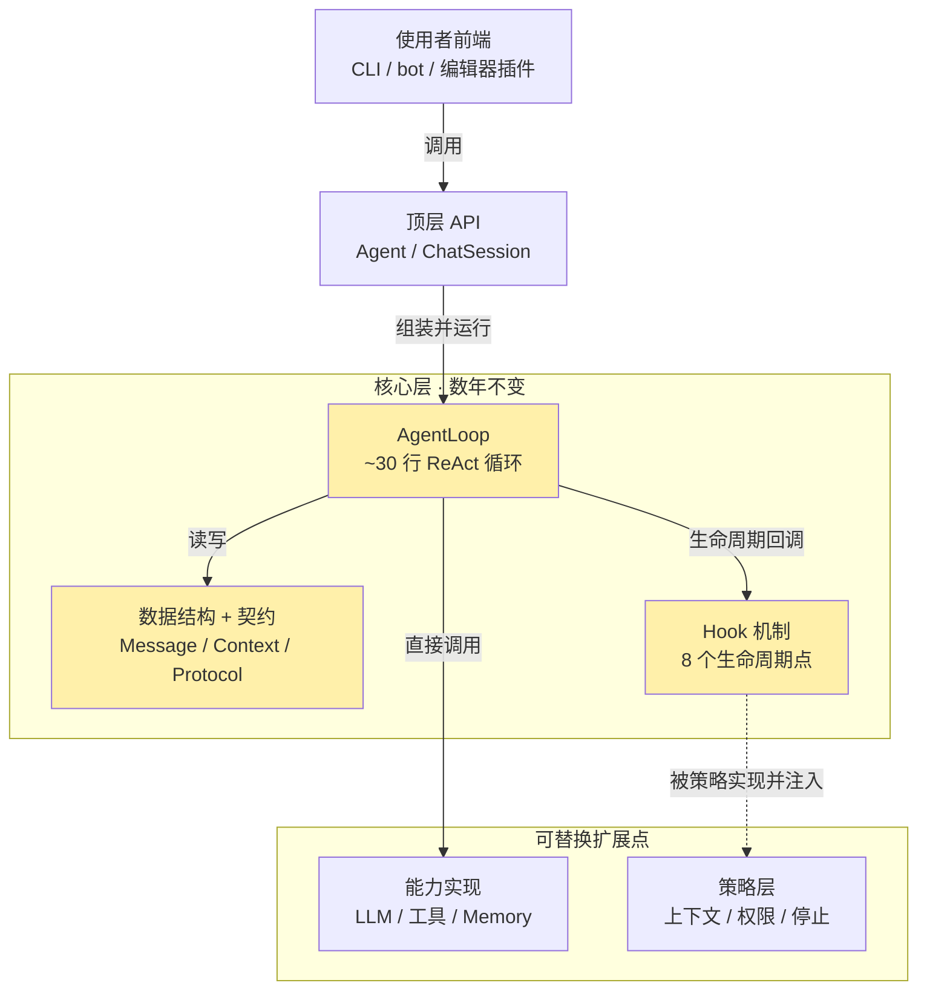

# nanoagent

[English](README.md) · **中文**

### 以 Harness 为核心的 ReAct **Agent** 框架

> 一条原则——**Stable Core + Pluggable Harness（稳定核心 + 可插拔 Harness）**：~30 行核心循环数年不变，**harness**（上下文工程 · 权限 · 熔断 · 可观测性）以策略形式插拔接入。核心读得懂、能学，harness 让它真能用。

> **状态：v0.1 基础版已实现**。核心循环 / 工具系统 / LLM 客户端（OpenAI 兼容，含 DeepSeek）/ in-memory memory / 默认策略 / 命令行入口均已落地，`python -m pytest` 61 passed（全程不联网）。**当前可从源码安装运行**（见[快速开始](#快速开始)）；PyPI 发布在即，届时 `pip install pynanoagent`（发布名加 `py` 前缀，导入仍 `import nanoagent`）。设计见 [`docs/DESIGN.md`](docs/DESIGN.md)。

## 这是什么

2026 年的 agent 框架生态有一个结构性空白：**编排类框架**（LangGraph / CrewAI）能让 agent 跑起来，但 context 管理、权限、可观测性往往是后补的，复杂且边界不清；**产品级 agent**（Claude Code / Cursor）harness 成熟却闭源、绑定模型、不可复用。「能让人读懂每一层为什么这样设计、同时又真正可用」的开源框架几乎是空白。

nanoagent 要填的就是这个空白，三个关键词缺一不可：

- **易于理解**：核心层代码量小、抽象少，能在一两小时读完 `core/loop.py` 并真正理解每一轮在做什么。
- **融入最佳实践**：context engineering、权限校验、熔断、memory 分层、skill 系统等社区已验证的工程实践，分阶段、有解释地引入。
- **真正可用**：不停在 toy 阶段——目标是 v0.4 能支撑长任务而不崩溃。

## 核心设计原则：Stable Core + Pluggable Strategy

整个项目押在一个切分上：把框架切成**核心层**（过去五年没本质变化、未来数年大概率也不变的部分——LLM 调用、循环、工具调度、数据结构）与**策略层**（随最佳实践演化的部分——怎么管上下文、怎么校验权限、怎么熔断）。核心层一旦定稿就不再改动；引入新最佳实践 = 在策略层新增一个实现，核心层不动。

下图回答：「nanoagent 由哪几层组成、运行时怎样互相调用？」



**读图要点**：暖黄三块是核心层，数年内不动。注意两种依赖方向的不对称——`AgentLoop` **直接调用**能力实现（LLM / 工具 / Memory 是循环跑起来的必需品，实线），却只**经 Hook 间接触达**策略层（虚线：策略实现某个 Hook 协议、被注入循环的某个生命周期点）。判据很简单：拿掉能力实现层循环就跑不起来，拿掉策略层循环仍能跑（退化成纯 ReAct）。核心层因此既不知道什么是 compaction、也不知道什么是 permission，它只知道「在某个时间点回调一组 hook」——这就是「核心稳定、策略可插拔」能成立的物理机制。

## 路线图

| 版本 | 范围 | 状态 |
|---|---|---|
| **v0.1 · Core** | 单 agent + 工具系统 + in-memory memory + 命令行 demo | ✅ 基础版完成（可源码运行，61 单测通过） |
| v0.2 · Skills + Trace + MCP | Skill 渐进式加载 + OpenTelemetry trace + 文件系统 memory + MCP 工具适配器 | 📋 计划 |
| v0.3 · Harness | 上下文管理多策略 + 权限系统 + 熔断器 + subagent | 📋 计划 |
| v0.4 · Eval | 三维度评估框架（独立 repo） | 📋 计划 |

## 快速开始

当前从源码安装（PyPI 发布后可直接 `pip install pynanoagent`，导入名仍 `nanoagent`）：

```bash
git clone https://github.com/eastonsuo/nanoagent && cd nanoagent
pip install -e .
```

**命令行对话**（需一个 OpenAI 兼容的 key）：

```bash
export OPENAI_API_KEY=sk-...          # OpenAI
nanoagent
```

换 **DeepSeek** 等兼容端点：模型名带前缀即自动识别端点，只需给对应 key（无需手设 base_url）：

```bash
export DEEPSEEK_API_KEY=sk-...        # DeepSeek（没有则回落 OPENAI_API_KEY）
export NANOAGENT_MODEL=deepseek-chat
nanoagent
```

**当库用** —— `@tool` 注册工具，一次性任务用 `Agent.run`、多轮对话用 `Agent(...).session()`：

```python
from nanoagent import Agent, tool

@tool
def word_count(path: str) -> int:
    """统计文本文件的单词数。"""
    return len(open(path).read().split())

agent = Agent("gpt-4o-mini", tools=[word_count])
print(agent.run("统计 README.md 有多少单词").output)     # 一次性，跨 run 无记忆

chat = agent.session()                                    # 多轮，记得上文
chat.send("我叫小明")
print(chat.send("我叫什么？").output)
```

## v0.1 已实现

| 层 | 模块 | 内容 |
|---|---|---|
| 核心层 · 数年不变 | `core/` | 数据结构 + 能力/策略契约 + 8 点 Hook + `AgentLoop`（~30 行 ReAct 循环）|
| 能力实现 | `tools/` `llm/` `memory/` | `@tool` + schema 自动生成；OpenAI 兼容客户端（+ 测试用 echo）；in-memory memory |
| 策略层 · 可插拔 | `strategies/` | 默认 noop / allow-all / max-turns + 把策略包成 Hook |
| 入口装配 | `api.py` `cli/` | `Agent` / `ChatSession` + 命令行 REPL |

- **可读性**：核心层（非 `__init__`）约 390 行，< 500。
- **测试**：`python -m pytest` → 61 passed，全程不联网、不需 API key（echo 客户端驱动全链路）。
- **依赖防线**：`core/` 不 import 任何外层目录——「稳定核心」原则的物理保证（设计 §8.1）。
- **OpenAI 兼容**：OpenAI / DeepSeek / Kimi / vLLM / Ollama，换模型名或端点即可。

## 文档

- [`docs/DESIGN.md`](docs/DESIGN.md) —— 权威设计文档（14 章）：概念与设计哲学、core/harness 解耦、核心数据结构与接口契约、整体架构、v0.1 详细设计、技术选型、与现有框架对比、风险。**实现细节一律以它为准。**

## 许可证

本项目采用 [MIT License](LICENSE)。
