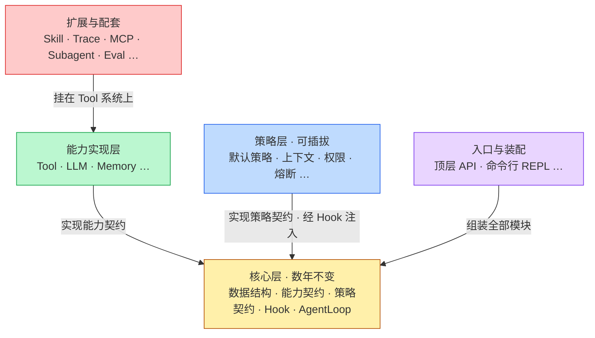
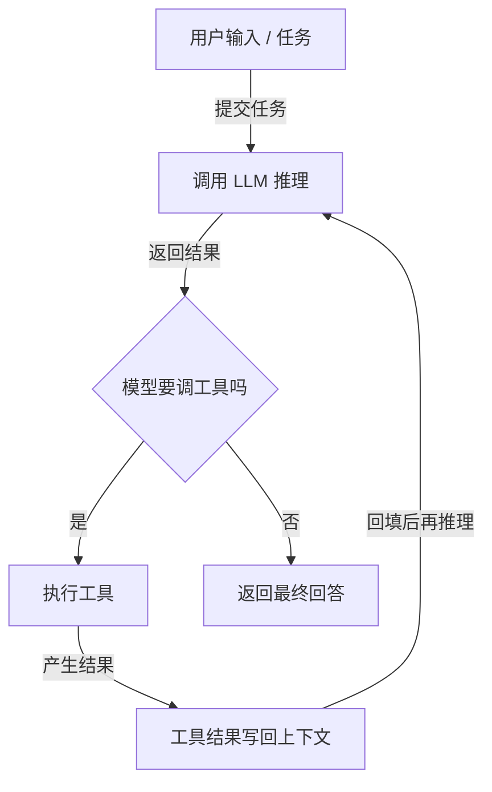
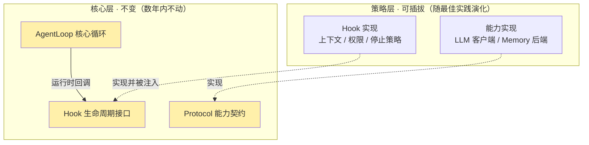
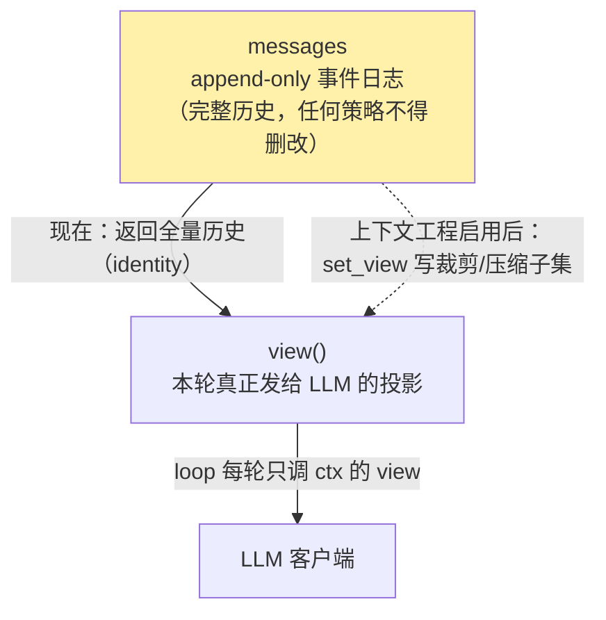
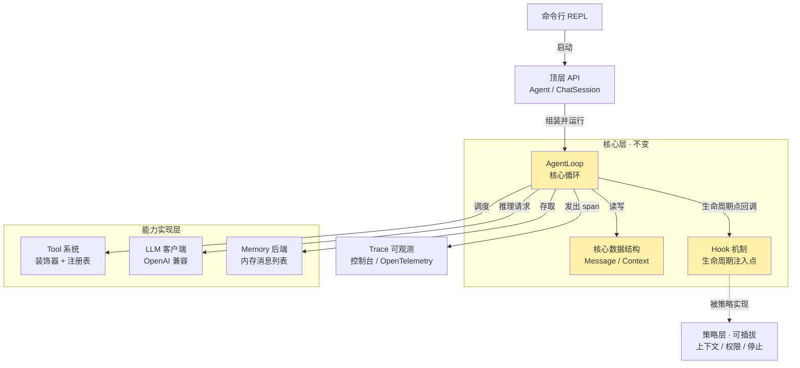
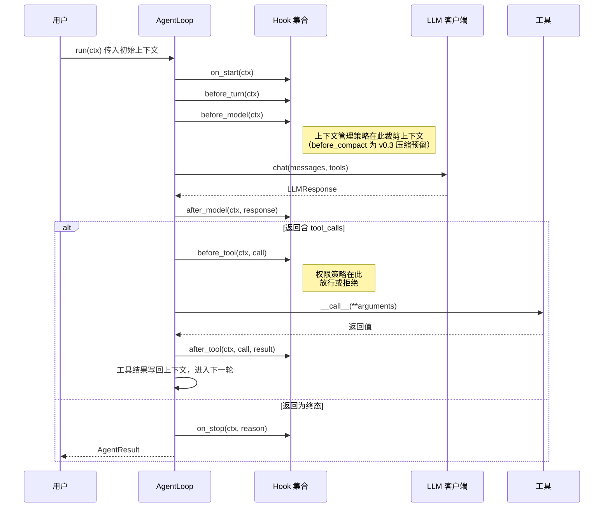
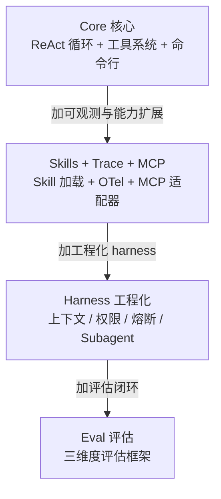

# nanoagent 设计文档

> 一个易于理解、可融入最佳实践、且能真正用于真实任务的单 agent Python 框架。本文档是 v0.1 实现前的设计依据 ：所有接口签名与核心代码均为设计草案，标注「待定」的部分会在第 14 章集中列出。

[toc]

---

## 第一部分 ：概念与设计

本部分按概念组织，目标是先把「agent 由哪些部分组成」「nanoagent 的核心设计原则是什么」讲清楚，再进入实现。

---

## 1. 项目简介与定位

### 1.1 一句话定位

**nanoagent** 是一个核心循环只有约 30 行、却能通过分阶段引入 harness 工程实践演进为真实可用运行时的单 agent 框架。它同时服务两类诉求 ：把 agent 的内部机制讲清楚，以及让人能基于它构建自己的 agent 应用。

作为定位的具体锚点 ：v0.1 的最小可用成品就是一个命令行 agent ——使用者装好后在终端直接输入 `nanoagent` 即可开始对话（详见第 11 章）。后续所有 harness 能力，都是在这个最小成品之上分阶段叠加的。

定位里有三个并重的关键词，缺一不可 ：

- **易于理解** ：核心层代码量小、抽象少，读者能在有限时间内读完并真正理解每一行。
- **融入最佳实践** ：context engineering、权限校验、熔断、memory 分层、skill 系统等社区已验证的工程实践，会被分阶段、有解释地引入。
- **真正可用** ：不是停在 toy 阶段的教学样例，v0.4 应当能支撑长任务而不崩溃。

「易于理解」是手段不是目的 ：它让最佳实践的引入过程可被读懂，从而让框架既能被学习、也能被信任地使用。

三个关键词比较抽象，用一个具体例子把它们落地。假设你要做这样一个 agent ：每天扫描下载文件夹，按类型把文件归档到对应子目录，并对其中的 PDF 逐个生成摘要写入一个索引文件。用 nanoagent 构建它时，三个关键词分别对应一件具体的事 ：

- **易于理解** ：你能在一两小时内读完 `core/loop.py` 的核心循环，清楚地知道这个 agent 每一轮在做什么。
- **融入最佳实践** ：当这个 agent 连续处理上百个文件、上下文不断累积逼近窗口上限时，你不需要自己发明上下文裁剪算法 ——nanoagent 的策略层提供了经过验证的实现，你按需启用一行配置即可。
- **真正可用** ：这个 agent 能挂在后台每天稳定运行 ——因为框架提供了熔断和权限校验这类 harness 保障。

### 1.2 为什么做这个项目

2026 年的 agent 框架生态存在一个结构性空白。

一类是**编排类框架**（LangGraph / CrewAI / AutoGen）。它们解决了「让 agent 跑起来」，但 context 管理、权限控制、可观测性往往是后补的能力，叠加在原本不为此设计的抽象之上，复杂度高且边界不清。

另一类是**产品级 agent**（Claude Code / Cursor 等）。它们的 harness 设计成熟，但闭源、绑定特定模型、不可改造、也不是可被复用的库。

「能让人读懂每一层为什么这样设计、同时又真正可用」的开源 agent 框架几乎是空白 ：`sanbuphy/nanoAgent` 停在约 100 行的 toy ；Anthropic Cookbook 是片段级示例而非完整框架。

nanoagent 要填的就是这个空白。它的**项目价值**可以归结为两点 ：

- **参考经典实践** ：把分散在各家产品与文档里的 harness 工程实践，整理成一套有清晰契约（Contract）、可对照阅读的实现。
- **可扩展** ：核心层稳定，能力与策略通过统一的扩展点接入，使用者可以替换策略、增加工具、包装自己的前端。

### 1.3 目标读者

| 读者类型 | 使用 nanoagent 的方式 |
|---|---|
| 想理解 agent 内部机制的工程师 | 阅读 `core/` 的核心循环与 `strategies/` 下的各实践实现，按版本路线理解能力的演进 |
| 想构建 agent 应用的开发者 | 把 nanoagent 当作 runtime，在其上叠加自己的前端（命令行 / bot / 编辑器插件 / 桌面 GUI） |
| 研究 agent 设计权衡的人 | 对照 `strategies/` 下不同实现的取舍，提交新的策略实现 |

### 1.4 全模块清单

下表是全文唯一的模块权威清单，分「固定不变」与「会随版本增长」两组（版本只在「会变」组标注，「契约」一词见 §1.5）。先看分层全局——下图按大类着色，回答「五个大类谁依赖谁」 ：



**读图要点** ：暖黄的**核心层**是地基，所有箭头都指向它 ；**能力实现层**与**策略层**各实现 core 的一类契约——前者（Tool / LLM / Memory）被循环直接调用，后者经 Hook 注入 ；**入口与装配**把它们组装成可运行的 agent ；**扩展与配套**多为工具形态、挂在 Tool 系统之上。颜色只区分大类、与版本无关——某大类下各模块在哪个版本落地，见下方各表的「阶段」列。

**第一组 · 固定不变（核心层）**——数年不改的稳定核心，一张闭合清单，全部 v0.1 落地 ：

| 模块 | 职责 | 主要依赖 |
|---|---|---|
| 核心数据结构 | `Message` / `ToolCall` / `ToolResult` / `Context` / `LLMResponse` / `AgentResult`，纯数据 dataclass | 无 |
| 能力契约 | `LLMClient` / `Tool` / `MemoryBackend`，LLM / 工具 / 记忆的统一接口 | 核心数据结构 |
| 策略契约 | `ContextStrategy` / `PermissionStrategy` / `StopStrategy`，仅协议、不含实现 | 核心数据结构 |
| Hook 机制 | 生命周期注入点的协议与默认空实现 | 核心数据结构 |
| AgentLoop | 约 30 行的核心循环，编排「推理 → 工具 → 回填」 | 全部 core |

**第二组 · 会随版本 / 需求增长（可扩展）**——按大类分多张表，每张以 `…` 行标注「凡满足对应契约者皆可接入」，并非封闭清单 ：

*能力实现层（必需品 · 被循环直接调用）—— 实现能力契约 ；拿掉它循环就跑不起来 ：*

| 模块 | 职责 | 阶段 | 主要依赖 |
|---|---|---|---|
| Tool 系统 | `@tool` 装饰器、注册表、从函数签名生成 schema | v0.1 | 能力契约 |
| LLM 客户端 | OpenAI 兼容客户端 + 测试用回声客户端 | v0.1 | 能力契约 |
| Memory 后端 | 默认 in-memory list 实现 | v0.1 | 能力契约 |
| 文件系统 Memory | 以工作目录作为持久 memory | v0.2 | Memory 后端 |
| `…` | 任何满足 `Tool` / `LLMClient` / `MemoryBackend` 契约的实现都可接入 | — | 能力契约 |

*策略层（harness 主体 · 经 Hook 注入）—— 实现策略契约的工程保障（权限 / 上下文 / 熔断）；拿掉它循环仍能跑、退化成纯 ReAct ：*

| 模块 | 职责 | 阶段 | 主要依赖 |
|---|---|---|---|
| 默认策略 | 上下文 noop、权限 allow-all、停止 max-turns | v0.1 | Hook 机制 |
| 上下文管理策略 | 截断、工具结果清理等多种 context engineering 策略 | v0.3 | Hook 机制 |
| 权限系统 | deny-first 策略管线 + 多档信任级别 | v0.3 | Hook 机制 |
| 熔断器 | token 预算 / 调用次数 / 成本上限三类熔断 | v0.3 | Hook 机制 |
| `…` | 任何满足策略 Protocol 的实现都可注入对应 Hook 点 | — | Hook 机制 |

*入口与装配 —— 把上面各块组装成可运行的 agent ：*

| 模块 | 职责 | 阶段 | 主要依赖 |
|---|---|---|---|
| 顶层 API | `Agent` / `ChatSession` 高层封装 | v0.1 | 全部 |
| 命令行 REPL | `nanoagent` 命令，交互式对话入口 | v0.1 | 顶层 API |
| `…` | 使用者可在顶层 API 上自建前端（bot / 编辑器插件 / GUI） | — | 顶层 API |

*扩展与配套 —— v0.2 之后叠加的工程能力 ：*

| 模块 | 职责 | 阶段 | 主要依赖 |
|---|---|---|---|
| Skill 系统 | 扫描目录、按 description 渐进式加载能力单元 | v0.2 | Tool 系统 |
| Trace 可观测 | OpenTelemetry span，覆盖 turn / LLM / 工具 | v0.2 | AgentLoop |
| MCP 工具适配器 | 把 MCP server 暴露的工具接入 Tool 系统（外部工具来源） | v0.2 | Tool 系统 |
| Subagent | `spawn_subagent` 工具，隔离上下文、只返回摘要 | v0.3 | Tool 系统 |
| Eval 框架 | 三维度评估，独立 repo | v0.4 | 全部 |
| `…` | 后续工程能力按需叠加，均不改 core | — | — |

两组的分界，正是项目核心设计原则（§3.1）的清单化表达 ：**第一组（核心层）数年不变、是上面唯一的闭合单表 ；其余四类都会随版本和需求增长，故拆成多表、以「…」标注开放。** 五个大类与第 6 章架构图一一对应。

### 1.5 核心术语 ：契约（Contract）

贯穿全文的「契约」一词，指 core 定义的抽象规范。**契约是抽象的协议 / 规范**，只规定「实现必须满足什么」，与用什么语言机制表达无关。在 core 里，契约有两种落地方式 ：

- **`@dataclass`——表达「数据形状」**（有哪些字段、什么类型）：如 `Message` / `Context` / `ToolCall`，固定的字段集合本身就是契约。
- **`typing.Protocol`——表达「行为接口」**（有哪些方法、什么签名）：如 `LLMClient` / `Tool` / `MemoryBackend` 及三个策略 Protocol，靠结构化鸭子类型 ——谁实现了这些方法谁就满足契约、无需继承。

两者都只是契约的**实现手段**，契约本身是抽象的（完整签名见第 5 章）。此外还有一类两者都表达不了的**行为约定**（如「`view()` 不得改 `messages`」「`tool` 消息必须带 `tool_call_id` 配对」），靠测试与 CI 依赖防线（§8.1）来守。

---

## 2. Agent 基础概念

本章是背景知识。已经熟悉 agent 内部机制的读者可以跳过，直接从第 3 章开始。

### 2.1 什么是 Agent

在本文档语境下，agent 指**一个能自主决定下一步动作、并通过调用工具与外部环境交互、直到完成任务的程序**。它与「一次性问答」的区别在于 ：问答是单轮的，agent 是多轮的，且每一轮的动作由模型自己决定，而非开发者预先写死。

### 2.2 Agent Loop 主循环

Agent 的核心是一个循环 ：把上下文交给模型推理，模型要么给出最终回答、要么要求调用工具 ；若调用工具，则执行工具、把结果写回上下文，再进入下一轮。这个「推理 → 行动 → 观察」的循环是 ReAct 模式的本质。

下图回答 ：「一轮 agent loop 内部有哪几个环节、如何循环？」



**读图要点** ：图中只画出了循环最主要的一种退出 ——模型在某一轮不再要求调用工具（「否」分支），这代表任务自然完成。但**这不是 agent 唯一的退出方式**。一个完整实现还有若干「防御性」退出 ：达到最大轮数、被权限策略中止、被熔断器中止。这几种退出在第 5.1 节的 `StopReason` 枚举里统一表示为 `DONE` / `MAX_TURNS` / `DENIED` / `BUDGET` ——只有 `DONE` 是「任务完成」，其余三个都是「被迫终止」。`feed` 回到 `model` 形成的回边，是整个 agent 区别于一次性问答的关键。

### 2.3 ReAct 循环与图编排 ：两种构建 agent 的方式

构建 agent 不止一种模式。ReAct 循环是最小、最常见的一种 ；图编排（以 LangGraph 为代表）是另一种，**同样是正当的 agent 实现方式**。两者的关系不是对立，而是**一般与特例** ：

- **ReAct 循环** ：控制流只有一个决策点 ——模型，每一轮由它通过 tool calling 决定下一步。框架侧的结构是固定的 while 循环。
- **图编排** ：开发者预先定义一张由节点和边组成的图。节点可以是确定性函数、LLM 调用，**也可以是一整个 ReAct 循环** ；边可以固定，也可以由模型输出决定。

图编排是**更一般的控制流抽象**。一个 ReAct 循环可被表达为图里的「单节点 + 自环条件边」，反过来则不能。nanoagent 只采用 ReAct 循环，是一个明确的范围决定 ：作为以可读性为首要目标的单 agent 框架，ReAct 循环是支撑单 agent 的**最小充分抽象**。

### 2.4 Tool 与 Function Calling

工具是 agent 与外部世界交互的手段。现代 LLM 通过 function calling 支持工具 ：开发者把工具的名称、描述、参数 schema（JSON Schema）提供给模型，模型在需要时返回结构化的 `tool_call`，框架负责执行并把结果写回上下文。

### 2.5 Context Window 与 Context Engineering

模型一次能处理的 token 数量有上限，即 context window。多轮 agent 任务中，上下文会随轮数累积膨胀。当上下文逼近窗口上限时，需要主动管理 ：截断旧消息、清理已无用的工具结果、对历史做摘要等。这类管理策略统称 context engineering，是 harness 工程的核心组成部分。

### 2.6 Memory 三层模型

- **Working memory** ：当前任务的对话历史，即上下文本身，任务结束即失效。
- **Episodic memory** ：跨任务的事件记录。
- **Semantic memory** ：可检索的知识库，通常由向量检索支撑。

nanoagent 在 v0.1 只实现 working memory（一个 message 列表），后两层在 v0.2 之后引入。

### 2.7 Subagent

Subagent 指由主 agent 派生出的、拥有独立上下文的子 agent。它用于隔离 ：把会产生大量中间结果的子任务交给 subagent，子 agent 在自己的上下文里完成，只把最终摘要返回给主 agent。nanoagent 把它实现为一个工具（`spawn_subagent`），由模型自主决定何时派生。

### 2.8 Skill 能力扩展

Skill 比 Tool 高一层 ：它是「一组工具 + 提示词 + 元数据」打包成的可复用能力单元。Skill 系统支持渐进式加载 ——平时只把简短描述放进上下文，模型判断需要时才加载完整内容。

### 2.9 Permission 与 Harness

Harness 是包裹在核心 agent loop 之外的一整套工程保障 ：权限校验、上下文管理、熔断、可观测性等。permission 负责在工具执行前做校验。一个没有 harness 的 agent 能跑 demo，但跑真实长任务时会出现误删数据、token 失控等问题。

### 2.10 Trace 可观测性

Trace 把 agent 的一次运行拆成一棵 span 树 ：一次 turn 是一个 span，其下挂着 LLM 调用 span、工具调用 span。借助 OpenTelemetry，trace 可被导出到 Jaeger 等后端查看。

---

## 3. 设计哲学

nanoagent 有三条设计原则，它们共同约束所有接口与实现决策。

### 3.1 Stable Core + Pluggable Strategy

这是项目最重要的核心设计原则 ：把框架切成**核心层**和**策略层**。

核心层是「过去五年没有本质变化、未来数年大概率也不变」的部分 ——LLM 调用、循环、工具调度、上下文数据结构。策略层是「随最佳实践持续演化」的部分 ——具体怎么管理上下文、怎么校验权限、怎么熔断。

核心层一旦定稿就不再改动 ；引入新的最佳实践等于在策略层新增一个实现，核心层不动。这个切分能否成立，取决于核心层与策略层之间的契约是否定义得足够干净。

### 3.2 简单易用，少抽象

接口设计遵循「不为简化而强行用类，也不为简化而强行避开类」：

- 表达契约 / 抽象边界 → 用 `Protocol` 或 `ABC`。
- 表达数据 → 用 `dataclass` ；只有在结构稳定且确需校验时才升级到 pydantic（v0.1 不引入）。
- 表达有状态的组件 → 用 class。
- 表达无状态的纯计算 → 用函数。
- 表达用户传入的回调 → 同时支持实现 `Protocol` 的 class 和普通 callable。

### 3.3 用真实问题驱动每一层抽象

每一层 harness 能力的引入，都应当对应一个具体的、可被讲清楚的问题 ：先展示「不加这层会出什么事故」，再引入这层。

---

## 4. Core 与 Harness 解耦设计

第 3.1 节提出了「核心稳定、策略可插拔」这条核心设计原则，本章回答它在代码层面**靠什么机制成立**。

### 4.1 解耦的两条规则

- **单向依赖** ：`core/` 不 import 任何 `strategies/` 下的代码。依赖只能从策略层指向核心层，反向被静态禁止。
- **Hook 注入** ：核心层在循环的若干生命周期点回调 Hook ；策略层通过实现 Hook 协议把自己的行为「插」进核心循环。核心循环本身不知道什么是 compaction、什么是 permission，它只知道「在某个时间点调用一组 hook」。

下图回答 ：「核心层与策略层在依赖方向与注入方式上如何解耦？」



暖黄节点是核心层（数年内不改）；实线表示「运行时调用」，虚线表示「实现某契约并被注入」。

**当前方案为何如此** ：把 harness 能力做成 Hook 注入，代价是引入了一层间接性。替代方案是核心层直接 import 并调用各策略，代码更直白，但那样核心层就与策略层耦合，第 3.1 节那条核心设计原则直接失效。nanoagent 选择承担这层间接性，并用一个缓解措施抵消它的学习成本 ：v0.1 的默认配置不带任何 hook，初学者第一次读到的核心循环就是纯粹的 ReAct。

**当前已如此优化** ：Hook 协议固定为 **8 个**生命周期点——在 6 个核心点之外，v0.1 定稿评审时参照成熟 harness 的 turn pipeline **预留**了 `on_start`（run 起始一次）与 `before_compact`（压缩前），因为新增注入点是破坏性变更，提前预留比日后追加更省事。其中 `before_compact` 在 v0.1 仅声明、`AgentLoop` 不 emit（无压缩），待 v0.3 接线。

### 4.2 Hook 与 Strategy 的关系

- **Hook** 是注入机制 ——它定义「在什么时间点可以插入行为」。
- **Strategy** 是可替换的算法 ——例如「如何截断上下文」。

一个上下文管理策略要生效，需要被一个 Hook 实现「包」起来 ：策略提供算法，Hook 负责在 `before_model` 这个时间点调用该算法。Strategy 回答「做什么」，Hook 回答「何时做」。

### 4.3 Hook 承载力自检（v0.1 纸面压测）

「稳定核心」是条核心设计原则，必须在 v0.1 就验证它扛得住最硬的场景——上下文工程。这里用一个**假想的 v0.3 压缩策略**压测一遍：实现「保留预算内的最近消息、更早的折叠出视图」，看 core 是否真的一行不改。

```python
# strategies/context/ —— 假想的 v0.3 压缩策略（仅用于压测，v0.1 不启用）
class KeepRecentContext:
    """保留 pinned 与预算内的最近消息；更早的折出视图。只读 messages、产出新列表。"""
    def reduce(self, messages: list[Message], budget_tokens: int) -> list[Message]:
        kept, used = [], 0
        for m in reversed(messages):
            if m.pinned or used < budget_tokens:           # pinned(system) 永远保留
                kept.append(m); used += m.token_estimate or 0
        return list(reversed(kept))                        # 折出的消息仍在 ctx.messages，只是不进本轮请求

# strategies/ 里把策略「包」成 Hook —— 这就是 §4.2 「Hook 包 Strategy」的实物
class ContextHook(BaseHook):
    def __init__(self, strategy: ContextStrategy, budget_tokens: int):
        self._s, self._budget = strategy, budget_tokens
    def before_model(self, ctx: Context) -> None:
        ctx.set_view(self._s.reduce(ctx.messages, self._budget))   # 只写投影，绝不碰日志
```

启用方式只是装配时多传一个 hook：`Agent(..., hooks=[ContextHook(KeepRecentContext(), 8000)])`。

**自检结论**：接入这个压缩策略，`core/loop.py`、8 个 Hook 签名、`Message/Context` 字段**一行都不改**——新代码全部落在 `strategies/`。这证明这条原则在上下文工程这个最硬的场景下成立；也正是为此，§5.1 的 `view()` 与那几个占位字段必须在 v0.1 就位——它们是「core 不改」的物理前提。

---

## 5. 核心数据结构与接口契约

本章是项目的契约层，决定核心层能否长期稳定。所有签名均为设计草案。契约的概念与两种落地方式（`dataclass` / `typing.Protocol`）见 §1.5，本章只给具体规格。

### 5.1 核心数据结构

```python
from dataclasses import dataclass, field
from typing import Any
from enum import Enum

@dataclass
class ToolCall:
    """模型发起的一次工具调用请求。"""
    id: str
    name: str
    arguments: dict[str, Any]

@dataclass
class ToolResult:
    """一次工具执行的结果。"""
    call_id: str
    content: str          # 工具返回值经字符串化后的内容（core 只做无损 str()，不截断）
    is_error: bool = False
    raw_bytes: int = 0    # v0.1 占位：content 字节数，供 v0.3 策略判断是否需清理
    elided: bool = False  # v0.1 占位：v0.3 上下文策略可据此把旧工具结果剔出视图（数据仍留 messages）

@dataclass
class Message:
    """对话中的一条消息。一旦 add 进 Context 即视为不可变事件，策略不得删改它。"""
    role: str             # "system" | "user" | "assistant" | "tool"
    content: str = ""
    tool_calls: list[ToolCall] = field(default_factory=list)
    tool_result: ToolResult | None = None
    # ↓ 以下为 v0.3 上下文工程预留的「抓手」，v0.1 仅填充、绝不消费（见 §5.1.1）
    pinned: bool = False           # True=裁剪策略不得丢弃（如 system / 关键决策）
    ephemeral: bool = False        # True=可被工具结果清理策略优先移出视图
    token_estimate: int | None = None  # 由上下文策略按需回填，供按预算截断/熔断判定

@dataclass
class Context:
    """一次 agent 运行的上下文。
    messages 是 append-only 事件日志（完整历史，策略不得删改）；
    view() 才是真正发给 LLM 的消息——v0.1 等于全量，v0.3 由上下文策略投影裁剪。"""
    messages: list[Message] = field(default_factory=list)
    metadata: dict[str, Any] = field(default_factory=dict)
    usage: dict[str, int] = field(default_factory=dict)       # 跨轮累计 token（熔断/显示用量的唯一入口）
    summary: str | None = None                                # v0.1 占位：承载 v0.3 压缩摘要产物
    _rendered: list[Message] | None = field(default=None, repr=False)  # before_model 写入的裁剪视图

    def add(self, message: Message) -> None:
        self.messages.append(message)
        self._rendered = None             # 历史变了，作废旧投影，下次 view() 回落到全量

    def add_usage(self, usage: dict[str, int]) -> None:
        for k, v in usage.items():
            self.usage[k] = self.usage.get(k, 0) + v

    def view(self) -> list[Message]:
        """真正发给 LLM 的消息。v0.1：identity=全量历史。
        v0.3：before_model 里的上下文策略调用 set_view() 写入裁剪结果。"""
        return self._rendered if self._rendered is not None else self.messages

    def set_view(self, messages: list[Message]) -> None:
        """由 before_model 的上下文策略调用，提交本轮发给模型的投影（不改 messages）。"""
        self._rendered = messages

@dataclass
class LLMResponse:
    """一次 LLM 调用的返回。assistant 消息自带的 tool_calls 即本轮工具调用（唯一权威源）。"""
    message: Message
    usage: dict[str, int] = field(default_factory=dict)   # 本轮 token 统计

class StopReason(Enum):
    DONE = "done"               # 模型不再调工具，任务完成
    MAX_TURNS = "max_turns"     # 达到最大轮数
    DENIED = "denied"           # 被权限策略终止
    BUDGET = "budget"           # 被熔断器终止

@dataclass
class AgentResult:
    """一次 agent 运行的最终结果。"""
    context: Context
    stop_reason: StopReason
    turns: int = 0                                        # 实际执行轮数（供 CLI 显示「N 轮」）
    usage: dict[str, int] = field(default_factory=dict)   # 跨轮累计 token（供 CLI 显示用量）

    @property
    def output(self) -> str:
        # 回扫最后一条「有内容的 assistant 文本」，避免在 MAX_TURNS（末条是工具结果）
        # 或权限拒绝（末条是 denial）时把非答复内容误当成输出。
        for m in reversed(self.context.messages):
            if m.role == "assistant" and m.content:
                return m.content
        return "" if self.stop_reason is StopReason.DONE else f"[未完成：{self.stop_reason.value}]"
```

#### 5.1.1 为什么 Context 是「事件日志 + 渲染视图」而非单一 messages 列表

这是整个核心数据结构里唯一一处「为 v0.3 预留」的设计，值得单独说明（也是 §3.3「用真实问题驱动抽象」的范例）。

v0.3 要做上下文工程（按 token 预算截断、清理旧工具结果、压缩历史成摘要）。这三件事都是「让模型**少看**一些」，但都**不应该让历史少一些**——`after_model`、`on_stop`、trace、subagent 摘要、调试都依赖完整历史。

因此 Context 把两件事分开：

- `messages`：append-only 事件日志，任何策略都不得删改，永远是「完整发生过什么」。
- `view()`：真正发给 LLM 的消息。v0.1 是 identity（`view() == messages`）；v0.3 由 `before_model` 里的上下文策略通过 `set_view()` 写入裁剪结果。

下图把这套「日志 + 投影」画出来，回答 ：「为什么 `Context` 不是一个 messages 列表，而是两件事？」



**读图要点** ：实线是 v0.1 的全量直投，虚线是 v0.3 上下文策略经 `set_view()` 写入的裁剪 / 压缩投影；无论走哪条，`messages` 这条事件日志都不被触碰。核心循环只认 `view()`，所以上下文工程是**纯投影**、不破坏历史。

核心循环只改一行：`llm.chat(ctx.view(), ...)`。上下文工程因此是**纯投影**，不破坏历史，core 数据结构与 30 行循环都不动。`Message` 上的 `pinned/ephemeral/token_estimate`、`ToolResult` 上的 `raw_bytes/elided`、`Context` 上的 `usage/summary` 全是**给 v0.3 策略读写的抓手，v0.1 只填充、不消费**——这样到 v0.3 接真实裁剪/压缩时，新增代码只落在 `strategies/`，core 一行不改。§4.3 给出对这套抽象的纸面压测。

被否决的更简方案：(A) 让策略直接删 `messages`——破坏不可逆历史；(B) 让 `before_model` 返回新列表——要破坏「8 个 Hook 点只有 `before_tool` 有返回值」的硬约束；(C) 在 api 层复制裁剪——把 harness 触发点挪出 `strategies`。`view()` 是唯一「不碰任何硬约束、又能承载 v0.3」的解，约 8 行纯 dataclass。

### 5.2 能力契约 Protocol

```python
from typing import Protocol, Any

class LLMClient(Protocol):
    """LLM 客户端契约，统一 OpenAI / Anthropic / 本地模型。"""
    def chat(
        self,
        messages: list[Message],
        tools: list["Tool"] | None = None,
        **kwargs: Any,
    ) -> LLMResponse:
        ...

class Tool(Protocol):
    """工具契约。用户日常用 @tool 装饰器，框架内部按此协议处理。"""
    name: str
    description: str
    schema: dict          # OpenAI Function Calling 的 JSON Schema

    def __call__(self, **kwargs: Any) -> Any:
        ...

class MemoryBackend(Protocol):
    """Memory 契约，working / episodic / semantic 三层均符合此接口。"""
    def store(self, key: str, value: Any, metadata: dict | None = None) -> None:
        ...
    def retrieve(self, query: str, k: int = 5) -> list[Any]:
        ...
    def delete(self, key: str) -> None:
        ...
```

### 5.3 Hook 生命周期契约

```python
@dataclass
class ToolDecision:
    """before_tool 的返回 ：是否放行一次工具调用。"""
    allowed: bool = True
    reason: str = ""

class Hook(Protocol):
    """Agent 生命周期钩子。所有 harness 能力都经此注入。"""
    def on_start(self, ctx: Context) -> None:
        """整个 run 开始时（仅一次）。"""
    def before_turn(self, ctx: Context) -> None:
        """每一轮 turn 开始前。"""
    def before_model(self, ctx: Context) -> None:
        """调用 LLM 前。上下文管理策略在此介入。"""
    def after_model(self, ctx: Context, response: LLMResponse) -> None:
        """LLM 返回后。"""
    def before_compact(self, ctx: Context) -> None:
        """上下文压缩前（v0.3 启用；v0.1 不 emit）。"""
    def before_tool(self, ctx: Context, call: ToolCall) -> ToolDecision:
        """执行工具前。权限校验策略在此介入，可拒绝调用。"""
    def after_tool(self, ctx: Context, call: ToolCall, result: ToolResult) -> None:
        """工具执行后。"""
    def on_stop(self, ctx: Context, reason: StopReason) -> None:
        """循环结束时。"""


class BaseHook:
    """8 个生命周期点的空实现。使用者继承它，只覆盖关心的点。"""
    def on_start(self, ctx: Context) -> None: ...
    def before_turn(self, ctx: Context) -> None: ...
    def before_model(self, ctx: Context) -> None: ...
    def after_model(self, ctx: Context, response: LLMResponse) -> None: ...
    def before_compact(self, ctx: Context) -> None: ...
    def before_tool(self, ctx: Context, call: ToolCall) -> ToolDecision:
        return ToolDecision(allowed=True)   # 默认放行，对齐 v0.1 allow-all
    def after_tool(self, ctx: Context, call: ToolCall, result: ToolResult) -> None: ...
    def on_stop(self, ctx: Context, reason: StopReason) -> None: ...
```

八个点中只有 `before_tool` 有返回值（`ToolDecision`），因为只有它需要影响核心循环的控制流。其余七个点是纯观察 / 副作用点。`on_start` 在整个 run 起始 emit 一次、`before_turn` 每轮 emit ；`before_compact` 为 v0.3 上下文压缩预留——v0.1 的 `AgentLoop` 不 emit 它（无压缩），与 §5.1.1 占位字段同属「v0.1 声明、暂不驱动」。使用者既可实现整个 `Protocol`，也可继承 `BaseHook` 只覆盖关心的点。

### 5.4 Harness 策略契约

```python
class ContextStrategy(Protocol):
    """上下文管理策略，由 before_model hook 调用。
    只读 messages（完整日志）、产出裁剪后的 message 列表，再由 hook 写进 ctx.set_view()——
    物理上无法破坏历史。产出列表须保持 tool_calls↔tool_result 配对完整（删工具结果须连带删其 tool_call）。"""
    def reduce(self, messages: list[Message], budget_tokens: int) -> list[Message]:
        ...

class PermissionStrategy(Protocol):
    """权限校验策略，由 before_tool hook 调用。"""
    def check(self, ctx: Context, call: ToolCall) -> ToolDecision:
        ...

class StopStrategy(Protocol):
    """停止条件策略，由 AgentLoop 每轮检查。"""
    def should_stop(self, ctx: Context, turn: int) -> StopReason | None:
        ...
```

**归属规则**：上面三个**策略 Protocol** 属于契约，放 `core/protocols.py`（core 依赖 core 内的协议，不违反单向依赖）；它们的**实现**放 `strategies/`。v0.1 即落三个协议 + 各一个默认实现：上下文 noop（不裁剪）、权限 allow-all（一律放行）、停止 `MaxTurnsStop`（只看轮数）。

```python
# strategies/stop/ —— 默认停止策略，实例由 api 装配层注入，core 只见 StopStrategy 协议
class MaxTurnsStop:
    def __init__(self, max_turns: int = 20): self.max_turns = max_turns
    def should_stop(self, ctx: Context, turn: int) -> StopReason | None:
        return StopReason.MAX_TURNS if turn >= self.max_turns else None
```

注意：`StopStrategy` 是 `AgentLoop` 的**构造参数**（不计入 8 个 Hook）——停止判定是控制流主干，不是可选注入。`StopReason.DONE` 在模型不再调工具时产生；`MAX_TURNS / BUDGET / DENIED` 统一经每轮轮首的 `should_stop` 产生（v0.1 只有 `MaxTurnsStop` 产 `MAX_TURNS`；v0.3 的熔断 / 权限类 StopStrategy 在超预算 / 硬越权时产 `BUDGET / DENIED`）。`before_tool` 返回的 `ToolDecision(allowed=False)` 是**软拒绝**：只对该次调用喂回 denial message 让模型换路，不终止整轮。

### 5.5 AgentLoop 核心循环

```python
class AgentLoop:
    def __init__(self, llm: LLMClient, tools: list[Tool],
                 hooks: list[Hook] | None = None,
                 stop: StopStrategy | None = None, max_turns: int = 20):
        self.llm = llm
        self.tools = {t.name: t for t in tools}
        self.hooks = hooks or []
        self.stop = stop or MaxTurnsStop(max_turns)      # 默认 max-turns，保持 noop 纯 ReAct

    def run(self, ctx: Context) -> AgentResult:
        self._emit("on_start", ctx)                          # 整个 run 起始一次
        turn = 0
        while True:
            reason = self.stop.should_stop(ctx, turn)        # 轮次/预算/成本统一在此判定
            if reason is not None:
                self._emit("on_stop", ctx, reason)
                return AgentResult(ctx, reason, turn, ctx.usage)

            self._emit("before_turn", ctx)                   # 每一轮 turn 开始（before_compact 为 v0.3 预留，v0.1 不 emit）
            self._emit("before_model", ctx)                  # 上下文策略在此 set_view()
            response = self.llm.chat(ctx.view(), tools=list(self.tools.values()))
            self._emit("after_model", ctx, response)
            ctx.add(response.message)
            ctx.add_usage(response.usage)                    # 累计 token

            if not response.message.tool_calls:              # 终态：模型不再调工具
                self._emit("on_stop", ctx, StopReason.DONE)
                return AgentResult(ctx, StopReason.DONE, turn + 1, ctx.usage)

            for call in response.message.tool_calls:
                decision = self._gate(ctx, call)             # before_tool：软拒绝→continue
                if not decision.allowed:
                    ctx.add(_denial_message(call, decision.reason))
                    continue
                result = self._invoke(call)
                self._emit("after_tool", ctx, call, result)
                ctx.add(Message(role="tool", tool_result=result))
            turn += 1
```

辅助函数契约（不铺进 30 行主体，但行为须定）：

- `_emit`：遍历所有 hook 调用对应方法。v0.1 **不吞** hook 抛出的异常（直接上抛），便于初学者快速暴露 hook bug；默认无 hook 时它是空操作。
- `_gate`：聚合所有 hook 的 `before_tool` 返回，**deny-first**——无 hook 时默认放行；任一返回 `allowed=False` 即拒绝，`reason` 取第一个拒绝者的。
- `_invoke`：真正执行工具。工具名不在注册表时返回 `ToolResult(is_error=True, content="unknown tool: ...")` 而非抛异常（模型可能幻觉工具名）；工具内业务异常转成 `ToolResult(is_error=True)` 喂回模型（异常处理边界见 §14.3 开放问题）。
- `_denial_message`：产出 `role="tool"` 且 `call_id` 对应被拒 `ToolCall` 的消息，保证 OpenAI 接口 tool_call/tool 配对完整（否则下一轮请求 400）。
- 用量累计：循环每轮 `ctx.add_usage(response.usage)` 累加进 `ctx.usage`，返回时连同轮数填入 `AgentResult.turns / .usage`（§11.2「3 轮 · 1,847 tokens」即来源于此；v0.3 熔断 StopStrategy 也读 `ctx.usage` 判断是否超预算）。

### 5.6 顶层装配契约：Agent 与 ChatSession

§5.1–§5.5 是 core 契约。`Agent` / `ChatSession` 是**装配层**（在 `api.py`，不在 `core/`，可 import 全部模块）——§11 的示例就靠它。字符串模型名的解析集中在这里，`core` 永远只见到解析后的 `LLMClient`。

```python
# nanoagent/api.py —— 装配层
def resolve_model(model: str | LLMClient) -> LLMClient:
    """'gpt-4o-mini' 这类字符串解析成 LLMClient；已是 LLMClient 则原样返回。
    读 API key、选 OpenAI 兼容 endpoint 都集中在这里。"""
    if not isinstance(model, str):
        return model
    from nanoagent.llm.openai_compat import OpenAICompatClient
    return OpenAICompatClient(model=model)

class Agent:
    """一次性任务的高层入口。无状态：每次 run 新建 Context。"""
    def __init__(self, model: str | LLMClient, tools: list[Tool] | None = None, *,
                 system_prompt: str | None = None, hooks: list[Hook] | None = None,
                 stop: StopStrategy | None = None, max_turns: int = 20):
        self._loop = AgentLoop(resolve_model(model), tools or [], hooks, stop, max_turns)
        self._system = system_prompt

    def run(self, prompt: str) -> AgentResult:
        ctx = Context()
        if self._system:
            ctx.add(Message(role="system", content=self._system, pinned=True))
        ctx.add(Message(role="user", content=prompt))
        return self._loop.run(ctx)

    def session(self) -> "ChatSession":
        return ChatSession(self._loop, self._system)

class ChatSession:
    """多轮对话：复用同一个无状态 AgentLoop + 持续累积的同一个 Context
    （开放问题 §14.3-Q3 的答案：复用 loop、状态在 Context.messages）。"""
    def __init__(self, loop: AgentLoop, system_prompt: str | None = None):
        self._loop = loop
        self.ctx = Context()
        if system_prompt:
            self.ctx.add(Message(role="system", content=system_prompt, pinned=True))

    def send(self, prompt: str) -> AgentResult:
        self.ctx.add(Message(role="user", content=prompt))
        return self._loop.run(self.ctx)   # 原地增长同一个 ctx
```

`Agent.run` 把 `str` 包成 user `Message`、`system_prompt` 包成 pinned 的 system `Message`、构造 `Context` 后调 `AgentLoop.run`——这就是 §11 里 `Agent("gpt-4o-mini", ...).run("...").output` 能跑通的全部装配。

---

## 6. 整体架构

下图回答 ：「nanoagent 由哪几层组成，运行时调用关系是怎样的？」



**当前方案为何如此** ：把「能力实现层」与「策略层」分成两组而不是合并，是一个有意的区分。能力实现层（LLM / 工具 / memory）被核心循环**直接调用**，因为这些是循环跑起来的必需品 ；策略层被核心循环**间接经 Hook 调用**，因为这些是可选的工程增强。判据是 ：拿掉能力实现层循环就跑不起来，拿掉策略层循环仍能跑（退化为纯 ReAct）。

---

## 7. 一轮 turn 的数据流

下图回答 ：「一轮 turn 里，AgentLoop、Hook、LLM 客户端、工具之间的调用如何一来一回？」



**当前方案为何如此** ：把权限校验放在 `before_tool` 而非工具内部，是一个边界设计选择。工具自身只负责「做事」，不负责「该不该做」。

**还能怎么优化** ：图中工具调用是串行的。当模型在一轮里返回多个相互独立的工具调用时，串行执行会拖慢整体延迟。可行的改法是在 v0.4 让相互独立的工具调用并发执行（`Agent.arun` 异步接口）。

---

## 第二部分 ：实现与运行

---

## 8. 代码目录设计

```text
nanoagent/
├── README.md
├── DESIGN.md
├── pyproject.toml
│
└── nanoagent/                # 主包
    ├── __init__.py           # 顶层导出 ：Agent, tool, Hook 等
    ├── __main__.py           # python -m nanoagent 入口
    ├── api.py                # Agent / ChatSession 顶层封装
    │
    ├── core/                 # 不变层，不 import 下面任何目录
    │   ├── loop.py           # AgentLoop 核心循环
    │   ├── context.py        # Context 数据结构
    │   ├── message.py        # Message / ToolCall / ToolResult
    │   ├── protocols.py      # 能力契约 Protocol
    │   ├── hooks.py          # Hook 协议 + BaseHook 空实现
    │   ├── errors.py         # 框架自定义异常
    │   └── stop.py           # StopReason 枚举
    │
    ├── tools/                # Tool 系统
    │   ├── decorator.py      # @tool 装饰器
    │   ├── registry.py       # 工具注册表
    │   ├── schema.py         # 从函数签名生成 JSON Schema
    │   └── builtin.py        # 内置工具
    │
    ├── llm/                  # LLM 客户端实现
    │   ├── openai_compat.py
    │   └── echo.py           # 测试用回声客户端
    │
    ├── memory/
    │   └── in_memory.py
    │
    ├── strategies/           # 可插拔策略层
    │   ├── context/
    │   ├── permission/
    │   └── stop/
    │
    ├── cli/
    │   ├── main.py
    │   └── repl.py
    │
    └── examples/
```

`core/` 与 `strategies/` 的切分是这套目录最关键的决定，由 §8.1 的静态检查守护。

### 8.1 依赖防线（CI 强制）

`core/` 不得 import 任何外层目录（`strategies` / `tools` / `llm` / `memory` / `cli` / `api`）——这是「稳定核心」这条核心设计原则的唯一物理保证。注意：策略 Protocol（`ContextStrategy` / `PermissionStrategy` / `StopStrategy`）属于**契约**，放在 `core/protocols.py`，故 `core` 依赖它们不算违规（依赖指向 core 自身）；策略的**实现**才在 `strategies/`。

两条等价检查，CI 至少跑其一：

```toml
# A. import-linter（推荐，进 pyproject.toml + CI；能查传递依赖与函数内延迟 import）
[tool.importlinter]
root_package = "nanoagent"

[[tool.importlinter.contracts]]
name = "core 不依赖任何外层"
type = "forbidden"
source_modules = ["nanoagent.core"]
forbidden_modules = ["nanoagent.strategies", "nanoagent.tools",
                     "nanoagent.llm", "nanoagent.memory",
                     "nanoagent.cli", "nanoagent.api"]
```

```bash
# B. grep 兜底（本地自检 / 最小 CI）：命中任意一行即失败
! grep -rnE "^(from|import)[[:space:]]+(nanoagent\.)?(strategies|tools|llm|memory|cli|api)" nanoagent/core/
```

---

## 9. 阶段路线 v0.1 — v0.4

下图回答 ：「四个版本各自加入了什么能力，按什么顺序累积？」



| 版本 | 参考估时 | 范围 | 验收标准 |
|---|---|---|---|
| v0.1 · Core | 1 周 | 单 agent + 工具系统 + in-memory memory + 命令行 demo | 核心代码 < 500 行 ；测试覆盖 > 70% ；命令行可对话、调工具、显示 token 用量 ；支持 OpenAI 及兼容接口 |
| v0.2 · Skills + Trace | 1 周 | Skill 渐进式加载 + OpenTelemetry trace + 文件系统 memory + **MCP 工具适配器** | 每个 turn / LLM 调用 / 工具调用都有 span ；至少一个完整可用 skill ；能接入一个 MCP server 的工具 |
| v0.3 · Harness | 2 周 | 上下文管理多策略 + 权限系统 + 熔断器 + subagent | 上下文策略 ≥ 3 种 ；deny-first 权限管线可用 ；能跑长任务不崩 |
| v0.4 · Eval | 1 周 | 三维度评估框架（独立 repo） | 30-50 个评估 case ；输出 case-by-case 报告 |

表中「参考估时」仅为粗略估算、**不绑定具体周期**——实际按依赖推进、以验收标准为准，不强制限时完成；单测随各模块同步写、保持本地可跑（详见 [`v0.1-design.md`](v0.1-design.md) §10）。v0.3 工作量最大且风险最高，建议拆成 v0.3.1（上下文 + 权限）与 v0.3.2（熔断 + subagent）。

---

## 10. v0.1 概览（详见 v0.1-design.md）

v0.1 的最小可用成品是一个命令行 agent ：装好后在终端输入 `nanoagent` 即可对话、调工具、看 token 用量（详见 §11）。它要做对的是**可演进性**而非功能完整——判据是 ：v0.3 引入真正的 harness 时，`core/` 目录一行不改。

**完整的 v0.1 实现级设计已独立成文**——范围边界、模块依赖、按依赖的实现顺序、逐模块签名 / 算法 / 测试矩阵、本版取舍，全部见 [`v0.1-design.md`](v0.1-design.md)；其中也保留了「每步完成判据」。本节不再展开，避免与之重复。

---

## 11. 入门示例 ：命令行中的 agent

### 11.1 安装与配置

```text
$ pip install nanoagent
$ export OPENAI_API_KEY=sk-...
$ nanoagent
```

### 11.2 一次带工具调用的对话

```text
▸ 看看当前目录里有哪些 .py 文件超过了 100 行

  [tool] list_files(directory=".", pattern="*.py")
  [tool] read_file(path="loop.py")
  [tool] read_file(path="api.py")

  当前目录有 2 个 .py 文件超过 100 行 ：
    - api.py     142 行
    - loop.py    118 行

  用量 ：3 轮 · 1,847 tokens
```

### 11.3 v0.1 的内置工具

v0.1 自带 ：读文件、写文件、列目录、执行 shell 命令、网页检索。使用者也可以用 `@tool` 装饰器注册自己的工具 ：

```python
from nanoagent import Agent, tool

@tool
def word_count(path: str) -> int:
    """统计文本文件的单词数。"""
    return len(open(path).read().split())

agent = Agent(model="gpt-4o-mini", tools=[word_count])
print(agent.run("统计 README.md 有多少单词").output)
```

### 11.4 关于 RAG

RAG 在 v0.1 的形态是**一个普通工具**，而非框架内置机制 ：使用者把检索逻辑包装成一个 `@tool` 函数，由模型自主决定何时调用。

---

## 第三部分 ：选型、对比与风险

---

## 12. 关键技术选型

### 12.1 LLM 客户端

v0.1 直接使用官方 `openai` SDK，并在其上包一层自己的 `LLMClient` 适配器。不选 `litellm`，因为它多一层抽象 ；OpenAI 兼容接口已覆盖 DeepSeek、Kimi、vLLM、Ollama。

### 12.2 Tool 协议

内部 schema 标准选 OpenAI Function Calling。不选 MCP 作为**内部**标准，因为 MCP 是跨进程协议。MCP 作为**外部**工具来源，已决定**从 v0.3 前移到 v0.2** 通过适配器接入——2026 MCP 已成 agent 基础设施，且只加适配器、不碰 core（见 §9 v0.2 验收、§14.3）。

### 12.3 数据结构 ：dataclass 而非 pydantic

核心数据结构全部用标准库 `dataclass`：零依赖、性能好、对初学者无额外学习成本。整个 v0.1 不引入 pydantic。

### 12.4 Trace

v0.1 用控制台彩色打印做最朴素的可观测 ；v0.2 才把 OTel 作为可选依赖引入。

### 12.5 Memory

v0.1 只实现 working memory。episodic（v0.2，基于 SQLite）与 semantic（基于向量检索）在后续版本引入。

### 12.6 同步而非异步

v0.1 到 v0.3 的接口以同步为主，v0.4 才提供可选的异步 API。同步优先的理由是 ：这是一个以可读性为首要目标的项目，异步会显著增加初学者阅读核心循环时的心智负担。

### 12.7 v0.1 依赖列表

```toml
[project]
dependencies = [
    "openai>=1.30",
    "prompt-toolkit>=3",
    "rich>=13",
    "tiktoken>=0.7",
    "duckduckgo-search>=6",
]

[project.scripts]
nanoagent = "nanoagent.cli.main:main"

[project.optional-dependencies]
trace = ["opentelemetry-sdk>=1.20"]
anthropic = ["anthropic>=0.30"]
```

---

## 13. 与现有框架对比

### 13.1 横向对比

| 项目 | 定位 | 量级 | harness 能力 | 可读性 |
|---|---|---|---|---|
| LangGraph | 图编排框架 | 约 50K 行 | 外接 | 低 |
| Claude Agent SDK | 官方 SDK | 闭源 | 内建 | 不适用 |
| sanbuphy/nanoAgent | 学习样例 | 约 100 行 | 无 | 高 |
| mini-swe-agent | 研究样例 | 约 100 行 | 无 | 高 |
| CrewAI | 多 agent 框架 | 约 20K 行 | 有限 | 中 |
| nanoagent | 易于理解 + 可用 | v0.1 约 500 行 / v0.4 约 2K 行 | 分阶段引入 | 高（核心约 30 行） |

### 13.2 ReAct 循环与图编排的关系

| 维度 | 图编排（LangGraph） | ReAct 循环（nanoagent） |
|---|---|---|
| 控制流骨架 | 开发者预先定义节点与边 | 固定的 while 循环 |
| 控制流决策点 | 分布在各条边 | 集中于模型，每轮一次 |
| 一个「节点」可以是 | 确定性函数 / 单次 LLM 调用 / 一整个 ReAct 循环 | 不适用 |
| 表达能力 | 更一般 | 较小，是图编排的特例 |
| 适合的场景 | 流程部分固定、需要确定性分支或并行 | 流程开放、步骤无法预先穷举 |
| 抽象成本 | 高 | 低 |

### 13.3 为什么 nanoagent 不做图编排

1. **最小充分原则** ：对单 agent 的绝大多数场景，ReAct 循环已经是最小充分的抽象。
2. **定位边界** ：一旦把图编排纳入核心，框架就从「单 agent 框架」漂移成「编排框架」。
3. **分层而非排斥** ：图编排作为更一般的层，正确的位置是在 nanoagent 之上。

**扩展路径** ：未来若需图编排，正确做法是一个独立的 `GraphExecutor`，它把 `AgentLoop` 作为图中单个节点的执行器。`AgentLoop` 整体作为节点时，ReAct 的循环（工具结果回填→再推理那条回边）被封装在节点**内部**，外层只编排节点之间的确定性流程——环始终在，只是从「核心循环的自环」收进了「一个图节点内部」，正印证 §2.3「ReAct = 单节点 + 自环」。这条路径不进入 v0.1 — v0.4 路线。

### 13.4 plan 在 nanoagent 里怎么落地：不做图编排 ≠ 不能 plan

§13.2/§13.3 论证了 nanoagent 不把图编排纳入核心，这**容易被误读为「nanoagent 没有 plan 能力」**。这是把 plan 的两种含义混为一谈了——而你对标的 Claude Code / Cursor 全是 ReAct，它们的 plan 能力都很强。

**plan 的两种含义：**

| | plan 作为**框架执行模型** | plan 作为 **Agent 能力 / 行为** |
|---|---|---|
| 谁执行 plan | 框架：planner 产 DAG → 编译成图 → 引擎按依赖跑 | 模型自己：在 ReAct 循环里一步步执行 |
| plan 活在哪 | 框架的图拓扑里（节点 / 依赖边） | **上下文里**（一段文本 / 一个 todo 列表） |
| 代表 | LangGraph / agent-core DynamicGraph | Claude Code 的 TodoWrite / plan mode |
| 重规划成本 | 重新规划 + 重新编译一张图 | 模型直接改写那段文本，免费 |

§13.3 不做的是**第一种**（框架执行模型）；nanoagent 完整保留并鼓励**第二种**（Agent 能力）。在 ReAct 里，plan 是模型能自由改写的**数据**，不是必须重新编译的**结构**。

**四个投入档位，全部落在现成扩展点上，都不动 `AgentLoop` 那 30 行：**

| 档位 | 怎么做 | 落在哪个扩展点 | 类比 |
|---|---|---|---|
| Prompt 级（零成本） | system prompt 让模型「先列计划再动手」，plan 即一段 assistant 文本 | 无需改动框架 | 朴素 CoT |
| 工具级（小，**推荐默认**） | 一个 `write_plan` / `todo` 工具，模型把计划写进上下文并持续勾选 | Tool 系统（§5.2 `Tool` 协议） | Claude Code TodoWrite |
| 模式级（中） | plan-then-execute：先出计划、可选人工确认、再放开执行 | 一个 `StopStrategy` / `Hook` 实现 | Claude Code plan mode |
| 编排级（重） | 显式 DAG + 并行执行器 | 独立 Tool / Skill 组件，绝不进核心 | agent-core DynamicGraph |

这与 §2.7 的 subagent、§11.4 的 RAG 是同一条原则——**能力优先做成工具，而非框架机制**：一个能力只要能由模型自主决定何时使用，就先做成 `@tool`，只有当它必须改变核心控制流时才升格为 Strategy（经 Hook 注入）。

**唯一真正放弃的是「框架级结构化并行 DAG」**（跨轮、带显式依赖边的并行）。但 ReAct 的单轮多 tool_calls 并发（模型一次吐多个调用、框架并发执行，见 §7「还能怎么优化」）已覆盖实践中绝大多数并行诉求；而真正的结构化并行 DAG，恰是 nanoagent 刻意挡在核心外的复杂度。

---

## 14. 风险与不确定性

### 14.1 设计层风险

**风险 1 ：Hook 协议的生命周期点可能不够。** 缓解 ：v0.1 定稿评审已参照成熟 harness 的 turn pipeline，把注入点从 6 个扩到 **8 个**（预留 `on_start` / `before_compact`）——新增点是破坏性变更，提前预留更省事。

**风险 2 ：「稳定核心」可能不真的稳定。** reasoning model 正在把循环的一部分内化进模型本身。缓解 ：短期数年内 nanoagent 的设计仍然成立。

**风险 3 ：「易于理解」与「Hook 抽象」存在张力。** 缓解 ：v0.1 默认配置不带任何 hook；且 §4.3 用一个假想的 v0.3 压缩策略压测了这层抽象，证明 core 不改即可承载——抽象成本真实存在，但已验证可控。

### 14.2 范围与时间风险

**风险 4 ：v0.3 的 harness 工程量被低估。** v0.3 要在同一版本里落上下文管理、权限系统、熔断器、subagent **四个相互独立的子系统**，每个都有自己的设计空间——尤其上下文工程是开放问题（截断 / 清理 / 摘要多策略并存），最易膨胀。把四者压在一个版本里，极易因某一项卡壳而拖垮整版节奏。缓解 ：① 拆成 **v0.3.1（上下文 + 权限）** 与 **v0.3.2（熔断 + subagent）**，各自独立可交付、独立验收，先交付前者再启动后者 ；② §4.3 已用一个假想压缩策略**纸面压测**过「core 一行不改」，所以 v0.3 的全部工程量都是 `strategies/` 内的**增量**、不回头动核心——风险被物理锁在策略层，不会外溢成跨层重构。

**风险 5 ：「真正可用」的承诺需要收窄。** 「真正可用」若作为一句笼统承诺必然 over-promise——不同人对「可用」的预期天差地别，模糊承诺只会透支信任。缓解 ：把它**按版本分级**，每级给一个可验收的具体含义 ：**v0.1** = 终端里能对话、能调工具、能看 token 用量的命令行 agent ；**v0.2** = 有 trace 可观测、至少一个可复用 skill ；**v0.3** = 能挂后台跑长任务不崩（上下文 / 权限 / 熔断到位）；**v0.4** = 有 eval 闭环为「可用」背书。这样「可用」在每个里程碑都是**可证伪**的具体断言，而非一句空头支票。

**风险 6 ：命名空间偏拥挤。** 缓解 ：PyPI 上 `nanoagent` 已确认可用（2026-05 实测返回 404），GitHub 仓库亦已建为 `eastonsuo/nanoagent`，故**定名 `nanoagent`**、不加 `py` 前缀（与 GitHub `sanbuphy/nanoAgent`、PyPI `nano-agent` 是不同的归一化名，无冲突）；`pynanoagent` 仅留作极端冲突时的休眠备选。

### 14.3 v0.1 实现前的开放问题：已定默认

下列 7 个问题已按推荐默认值拍板（v0.1）。每条都保留「使用者可覆盖」的扩展路径，未来真有需要时在 strategies / 能力层调整、不动 core。

- **系统 prompt 默认值**：内置一段 ~150–250 token 的通用 prompt（只讲「你能调工具 / 需要就调别编 / 完成就直接答即结束」），放 api/cli 层（不进 core），`Agent(system_prompt=...)` 可整体覆盖。不照搬产品级长 prompt（绑模型、损可读性）。
- **工具结果字符串化**：core 只做**无损** `str()` / `json.dumps`，**绝不在 core 截断或摘要**；「内容过大怎么办」整体是 v0.3 `ContextStrategy` 的职责，v0.1 默认 noop。`ToolResult.raw_bytes / elided`（§5.1）即为此预留。
- **`ChatSession` 实现**：`AgentLoop` 保持无状态（`run(ctx)` 纯函数）；`ChatSession`（§5.6）复用同一个 loop + 持续累积的同一个 `Context`。状态归 Context、编排归 Loop。
- **工具异常处理**：默认 `except Exception` → `ToolResult(is_error=True)` 喂回模型 self-heal；`BaseException`（Ctrl-C / SystemExit）与框架 `FatalError` 直接上抛。v0.1 不做「可配置异常策略」（与 §5.5 `_invoke` 契约一致）。
- **工具命名规则**：`@tool` 注册时强制 `^[a-z][a-z0-9_]*$` 且 ≤64 字符，默认取函数名（天然 snake_case），重名报错；v0.1 **不**引入 namespace 前缀（留到 Skill / MCP 多来源出现重名时）。
- **命令行首次配置**：环境变量优先 → `~/.nanoagent/config.toml` → 都没有则一次性引导 wizard 粘贴 key（写 600 权限）。读用标准库 `tomllib`、写用手工拼字符串（不引第三方 toml 库，守依赖 ≤5）。
- **REPL 流式输出**：v0.1 默认整段打印（等待时 spinner），不进核心循环做逐 token；但在 `LLMClient` 协议预留 `chat_stream` 形状，v0.2 让 REPL 旁路直接调它（不改 core）。

> **原两项开放问题均已拍板**：
> ① **MCP 接入前移到 v0.2**——通过适配器把 MCP server 工具接入 Tool 系统，仅适配器、不碰 core（2026 MCP 已成 agent 基础设施）。见 §1.4 / §9 v0.2 / §12.2。
> ② **Hook 点 6 → 8**——加入 `on_start`（run 起始一次）与 `before_compact`（压缩前预留，v0.1 声明但 `AgentLoop` 不 emit），见 §5.3 / §5.5。

### 14.4 已知债务

- 面向第三方前端的事件流 / 中断接口尚未设计。
- 工具调用串行执行，独立工具调用的并发优化依赖 v0.4 的异步接口。
- 权限信息分散 ：工具自身无法表达「我天然危险」。

---

## 附录 ：下一步

本设计文档定稿后，进入 v0.1 实现的第一步是 ：把第 5 章的接口签名从设计草案落成可直接写入 `core/` 的代码，并搭好对应的测试骨架。第 14.3 节的开放问题建议在动手写 `core/loop.py` 之前先逐个回答。
