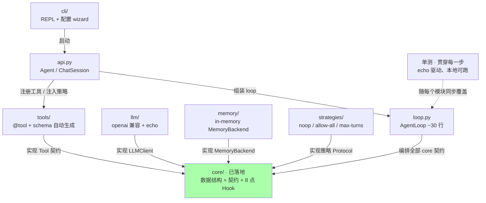
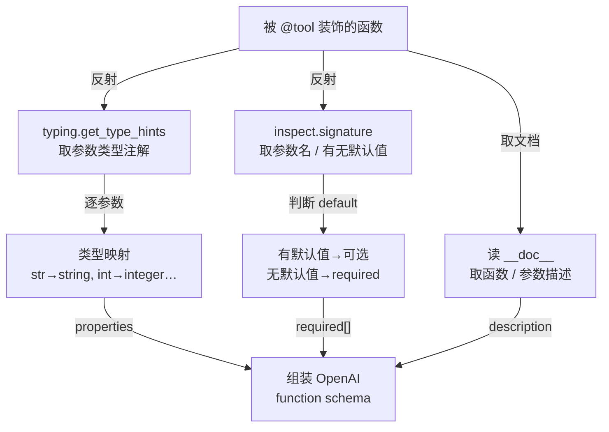
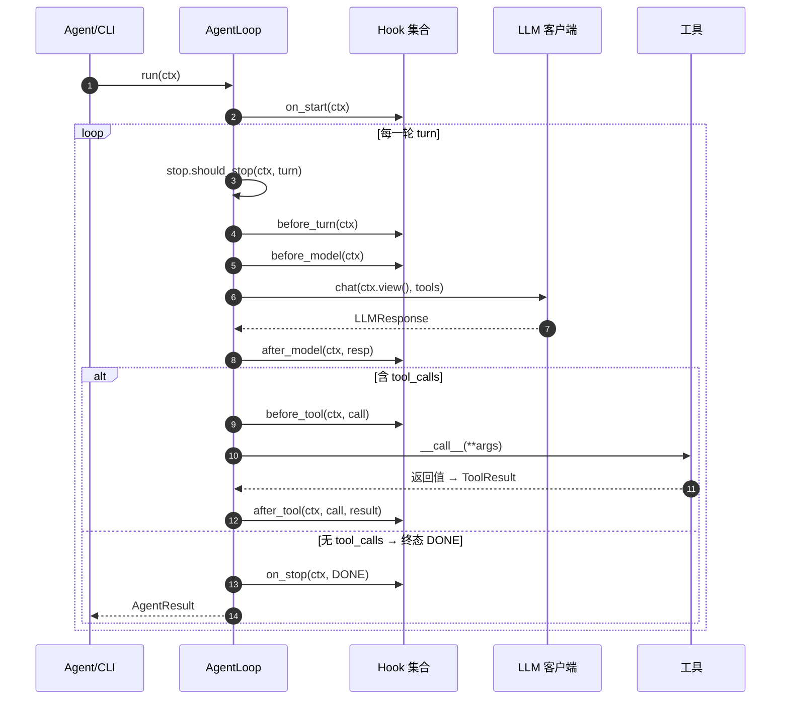
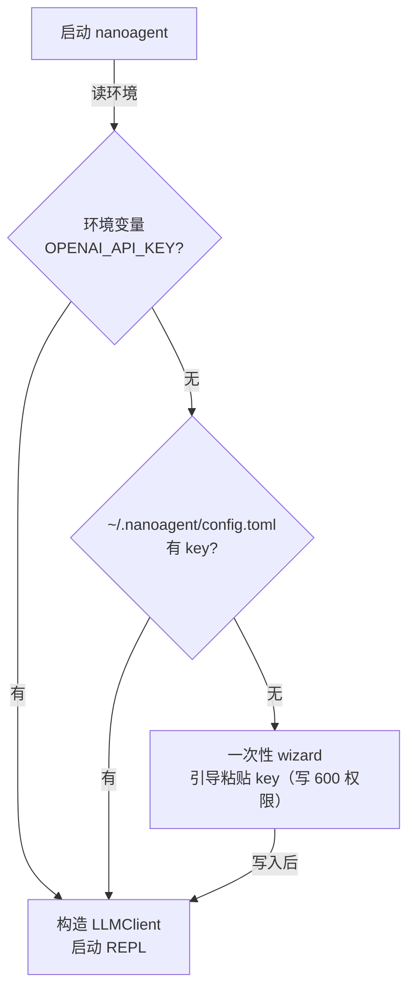

# nanoagent v0.1 实现级详细设计

> 本文是 [`DESIGN.md`](DESIGN.md) 第 10 章的**实现级展开**：把 v0.1 各模块从「设计草案」落到「可直接指导编码」的程度——逐模块给出职责、关键签名、非平凡算法、边界 case 与测试计划。
>
> **总纲与契约仍以 `DESIGN.md` 为准**（尤其第 5 章核心数据结构与接口契约）；本文不重复定义契约，只在其上展开实现。`core/` 已落地，其余模块按下文的构建顺序逐日实现。

[toc]

---

## 1. 这份文档怎么读

DESIGN.md 回答「nanoagent 由哪些部分组成、为什么这样切分」（含 core 的权威契约 §5）；本文回答「v0.1 怎么落地」，分两部分、**先设计后实现**：

- **第一部分 · 设计（§3）**：讲清 **core 的设计**——稳定核心为什么这样切（事件日志 + `view()` 投影、~30 行循环、8 个 Hook、Protocol 契约 + 单向依赖）。重「为什么」，完整字段/签名指向 [DESIGN §5](DESIGN.md#5-核心数据结构与接口契约)、不重述。
- **第二部分 · 实现思路（§4 起）**：按依赖顺序逐模块讲「怎么写」——签名、非平凡算法、边界、单测。

实现章的组织顺序是**按依赖**（不是代码分层、也不绑定「第几天」）：从被依赖的底层往上叠，读到 `loop.py` 那章时，它依赖的 `tools / llm / memory / strategies` 都已就位。**时长不强制**——「一周」只是粗略参考、不是工期承诺。

每个实现章固定回答：**要做什么 → 关键签名 → 有没有非平凡算法 → 怎么连同单测一起写**。单测与代码**同步写**、用 echo 客户端本地跑（不依赖网络与 API key），目标是任何时刻「本地可运行 + 有覆盖」。涉及真实设计取舍的图配三段式解读；只展示静态结构的图只走读一遍。

---

## 2. v0.1 全景：造什么、按什么顺序造

v0.1 的成品是「终端里输入 `nanoagent` 就能对话、能调工具、能看 token 用量」的命令行 agent。它要做对的是**可演进性**，不是功能完整——判据是：v0.3 接真正的 harness 时 `core/` 一行不改（[DESIGN §10](DESIGN.md#10-v01-概览详见-v01-designmd)）。

下图回答：「v0.1 八个构建单元谁依赖谁、按什么顺序落地？」



**逐步走读**：绿色 `core/` 是已落地的地基，其余都指向它。`tools / llm / memory / strat` 是**能力与策略实现**，各自实现 core 里的一个 Protocol，彼此不依赖；`loop.py` 把这些契约编排成 ReAct 循环；`api.py` 是唯一「知道全部模块」的装配层，把字符串模型名解析成 `LLMClient`、把工具/策略/hook 组装进 `AgentLoop`；`cli/` 再在 api 之上包一层 REPL。`单测`不是末尾一个阶段，而是**随每个模块同步写**——用 echo 客户端（不打真实网络）在本地跑通该模块路径，每加一块都保持「本地可运行 + 有覆盖」。

**当前方案为何如此**：顺序的唯一约束是「先做被依赖的」——`loop` 依赖四个能力/策略契约的**实现**才能跑通最小循环，所以它排在 core（只定**契约**、不含 loop 实现）与四个实现**之后**。`api` 依赖面最广所以最后装配，但它**不在 `core/` 内**，因此「core 不依赖外层」这条线没破。能力实现层（`tools/llm/memory`）与策略层（`strat`）分开，是因为前者被循环**直接调用**、后者经 Hook **间接注入**（[DESIGN §6](DESIGN.md#6-整体架构)）。这是**依赖序、不是日历**——每块多久完成不重要，先后关系才是约束。

**还能怎么优化**：`tools / llm / memory / strat` 之间零依赖，理论上可并行推进；单人开发串行即可。每个指向 core 的节点都是一个**独立可测单元**——配合「随模块写单测」，每块写完即用 echo 客户端单测验证，这张依赖图也是天然的任务切分依据。

### 2.1 实现顺序与每步完成判据

下表是按依赖推进的顺序与每步**完成判据**（「顺序」是依赖序、不是日历，时长不强制；原在 [DESIGN §10](DESIGN.md#10-v01-概览详见-v01-designmd)，随本文档独立而迁来）：

| 顺序 | 任务 | 完成判据 |
|---|---|---|
| 1 | `core/`：数据结构、能力契约、Hook 契约 | 类型检查通过、契约完整 |
| 2 | `tools/`：`@tool` + 自动 schema 生成 | 能注册内置工具，schema 与 OpenAI 格式一致 |
| 3 | `llm/` + `memory/` + 默认策略 | echo 驱动跑通最小循环（不开 hook） |
| 4 | `loop.py`：`AgentLoop` 完整实现 | 第一个示例（hello agent）跑通 |
| 5 | `api.py` + `cli/` | `nanoagent` 命令可启动 REPL 并对话 |
| 6 | 补齐覆盖率 + 第二个示例（research agent） | 覆盖 > 70%（单测已随 1–5 同步写） |
| 7 | README + 整体走查 | 能在 30 分钟讲清 v0.1 |

---

## 3. core 速览（设计与契约都在 DESIGN）

core 是 nanoagent 的心脏。它的**完整设计与契约都在 DESIGN**——本节只做速览：把后续实现章要用的关键决策一句话点出、给出可点跳转，不在这里重述「为什么」。

- **上下文 = 事件日志 + view() 投影**：`messages` 只追加（完整历史、不删改），`view()` 才是发给 LLM 的投影；v0.1 是全量 identity，v0.3 由上下文策略 `set_view()` 裁剪。loop 只调 `chat(ctx.view())`。→ 为什么这样设计（含被否的 3 个更简方案）见 [DESIGN §5.1.1](DESIGN.md#511-为什么-context-是事件日志--渲染视图而非单一-messages-列表)。
- **~30 行 ReAct 循环 + StopReason 四态**：主体不含具体策略代码（都在 `_emit` / `_gate` / `stop` 背后）；`DONE` 自然完成，`MAX_TURNS / DENIED / BUDGET` 被迫终止。→ [DESIGN §5.5 AgentLoop 核心循环](DESIGN.md#55-agentloop-核心循环)。
- **8 个 Hook，只有 `before_tool` 改控制流**：harness 能力经 Hook 注入，core 不知 compaction / permission；`before_compact` 在 v0.1 声明但不 emit。→ [DESIGN §4 解耦设计](DESIGN.md#4-core-与-harness-解耦设计)、[§5.3 Hook 契约](DESIGN.md#53-hook-生命周期契约)。
- **Protocol 契约 + 单向依赖**：`LLMClient` / `Tool` / `MemoryBackend` + 三个策略 Protocol 都属 core；**`core/` 不 import 任何外层**（import-linter 守，契约已进 `pyproject.toml`）。→ [DESIGN §5.2 能力契约](DESIGN.md#52-能力契约-protocol)、[§8.1 依赖防线](DESIGN.md#81-依赖防线ci-强制)。

完整字段 / 签名以 [DESIGN §5 核心数据结构与接口契约](DESIGN.md#5-核心数据结构与接口契约) 为准；下面两张速查表便于对照实现章。

**核心数据结构**（纯 `dataclass`，零第三方依赖）：

| 结构 | 关键字段 | 后续谁在用 |
|---|---|---|
| `ToolCall` | `id` / `name` / `arguments: dict` | llm 解析模型输出 → loop 调度 → tools 执行 |
| `ToolResult` | `call_id` / `content: str` / `is_error` / `raw_bytes` / `elided` | loop 回填；`raw_bytes/elided` 为 v0.3 占位 |
| `Message` | `role` / `content` / `tool_calls` / `tool_result` / `pinned` / `ephemeral` / `token_estimate` | 全链路；后三个为 v0.3 上下文工程占位 |
| `LLMResponse` | `message` / `usage: dict` | llm.chat 返回；loop 累计 usage |
| `Context` | `messages`(append-only) / `usage` / `summary` / `_rendered` | loop 读 `view()`、写 `set_view()`；api 持有 |
| `AgentResult` | `context` / `stop_reason` / `turns` / `usage` + `output` | loop 返回；cli 显示 |
| `StopReason` | `DONE` / `MAX_TURNS` / `DENIED` / `BUDGET` | loop 与 StopStrategy |

**8 个 Hook 生命周期点**（只有 `before_tool` 有返回值 `ToolDecision`；其余纯观察）：

| 点 | 何时调 | v0.1 是否 emit | 典型策略 |
|---|---|---|---|
| `on_start` | 整个 run 起始一次 | ✅ | 初始化 / 起始日志 |
| `before_turn` | 每轮开始 | ✅ | 轮次计数 / trace span |
| `before_model` | 调 LLM 前 | ✅ | **上下文裁剪**（`set_view`） |
| `after_model` | LLM 返回后 | ✅ | usage 观察 / trace |
| `before_compact` | 压缩前 | ❌ **声明不 emit** | v0.3 压缩策略 |
| `before_tool` | 执行工具前 | ✅ | **权限校验**（可拒绝） |
| `after_tool` | 工具执行后 | ✅ | 结果观察 / 清理标记 |
| `on_stop` | 循环结束 | ✅ | 收尾 / 落盘 |

`before_compact` 在 v0.1 是「声明但 `AgentLoop` 不 emit」的预留点——与 `Message.token_estimate` 等占位字段同属「v0.1 声明、暂不驱动」，避免日后新增注入点成为破坏性变更（[DESIGN §4.1](DESIGN.md#41-解耦的两条规则)、§14.1）。

---

## 4. tools/ —— `@tool` 与 schema 自动生成

**要做什么**：让使用者写一个带类型注解和 docstring 的普通函数、加一行 `@tool` 就能被模型调用。模块拆成四个文件：`decorator.py`（`@tool`）、`registry.py`（注册表）、`schema.py`（签名→JSON Schema）、`builtin.py`（内置工具）。

### 4.1 `@tool` 装饰器与 Tool 协议

`@tool` 把函数包成满足 core `Tool` 协议（`name` / `description` / `schema` / `__call__`）的对象：

```python
def tool(fn=None, *, name=None, description=None):
    """把普通函数注册为工具。直接 @tool 或 @tool(name=...) 都可。"""
    def wrap(f):
        t_name = name or f.__name__
        _validate_name(t_name)                       # ^[a-z][a-z0-9_]*$ 且 ≤64（§14.3）
        return FunctionTool(
            fn=f,
            name=t_name,
            description=description or _first_doc_line(f),
            schema=build_schema(f, t_name, description),
        )
    return wrap(fn) if fn is not None else wrap
```

`FunctionTool` 是一个 `@dataclass`，`__call__` 直接转调原函数。命名规则强制 `^[a-z][a-z0-9_]*$` 且 ≤64 字符，默认取函数名（天然 snake_case），**重名在注册表 `register()` 时报错**；v0.1 不引入 namespace 前缀（留到 Skill / MCP 多来源出现重名时，[DESIGN §14.3](DESIGN.md#143-v01-实现前的开放问题已定默认)）。

### 4.2 非平凡算法：函数签名 → OpenAI Function Schema

这是 v0.1 唯一真正需要算法的地方。下图回答：「一个带注解的函数，怎么变成模型能读的 JSON Schema？」



**逐步走读**：① `inspect.signature(fn)` 拿到参数名与 `param.default`（用 `inspect.Parameter.empty` 判断有无默认值）；② `typing.get_type_hints(fn)` 拿到每个参数的类型注解（比读 `__annotations__` 更稳，能解析字符串化注解）；③ 读 `fn.__doc__` 作为 function 的 `description`；④ 逐参数把 Python 类型按下表映射成 JSON Schema 类型；⑤ 无默认值的参数进 `required` 数组；⑥ 组装成 OpenAI function calling 结构。

类型映射表（v0.1 支持的范围）：

| Python 注解 | JSON Schema | 说明 |
|---|---|---|
| `str` | `{"type": "string"}` | |
| `int` | `{"type": "integer"}` | |
| `float` | `{"type": "number"}` | |
| `bool` | `{"type": "boolean"}` | |
| `list` / `list[T]` | `{"type": "array"}`（v0.1 不深挖 items） | T 暂不展开 |
| `dict` / `dict[..]` | `{"type": "object"}` | |
| `X \| None` / `Optional[X]` | 按 X 映射 + 不进 required | |
| 无注解 | 退化为 `{"type": "string"}` + 告警 | 鼓励但不强制注解 |

产出形如：

```json
{
  "type": "function",
  "function": {
    "name": "read_file",
    "description": "读取文本文件内容。",
    "parameters": {
      "type": "object",
      "properties": {"path": {"type": "string", "description": "文件路径"}},
      "required": ["path"]
    }
  }
}
```

**当前方案为何如此**：用标准库 `inspect` + `typing` 而不是 pydantic——v0.1 的硬约束是核心依赖 ≤5、不引 pydantic（[DESIGN §3.2](DESIGN.md#32-简单易用少抽象)、§12.3）。代价是类型覆盖窄（不做嵌套 model 校验、不解析 `list[T]` 的 item 类型），但 v0.1 的内置工具参数都是 `str/int` 这类标量，够用；参数描述靠约定（在 docstring 里用简单格式写），不强行解析 Google/Numpy docstring 风格。

**还能怎么优化**：① `list[T]` 目前丢掉了 item 类型——可在 v0.2 用 `typing.get_args` 补 `items` 字段，收益是数组型参数更精确，成本是要处理嵌套；当前没做是因为内置工具不涉及。② docstring 里的**参数级**描述 v0.1 没解析（只取首行做 function 描述）——可在 v0.2 加一个轻量 docstring 解析器把每个参数的说明填进 `properties[x].description`，对模型理解参数帮助大；当前为控制复杂度暂缓。③ 若引入 Skill/MCP 多来源工具，重名将常态化——届时把「重名报错」升级为「namespace 前缀」，这是已知扩展点。

### 4.3 注册表与内置工具

`registry.py` 维护一个 `name -> Tool` 字典，`register()` 时校验重名；loop 拿到的是 `list[Tool]`，内部转 `{t.name: t}`（与 [DESIGN §5.5](DESIGN.md#55-agentloop-核心循环) `AgentLoop.__init__` 一致）。v0.1 内置工具：

| 工具 | 签名 | 用途 |
|---|---|---|
| `read_file` | `(path: str) -> str` | 读文本文件 |
| `write_file` | `(path: str, content: str) -> str` | 写文件，返回确认 |
| `list_files` | `(directory: str, pattern: str = "*") -> list[str]` | 列目录 |
| `run_shell` | `(command: str) -> str` | 执行 shell（v0.1 无沙箱，靠 v0.3 权限策略约束） |
| `web_search` | `(query: str, k: int = 5) -> list[str]` | duckduckgo-search 检索 |

**怎么测**：`build_schema` 对若干样例函数断言产出 schema 与手写 OpenAI 格式逐字段一致；命名校验对非法名（大写、数字开头、超长）断言抛错；注册表对重名断言抛错。这些都是纯函数测试，不需网络。

---

## 5. llm/ —— OpenAI 兼容客户端与 echo

**要做什么**：实现 core 的 `LLMClient` 协议。两个实现：`openai_compat.py`（真实，包官方 `openai` SDK）与 `echo.py`（测试用，不打网络）。

### 5.1 OpenAICompatClient

核心职责是**在 core 的 `Message` 与 OpenAI 的 message dict 之间双向翻译**，并调 `client.chat.completions.create`。双向字段映射：

| 方向 | core | OpenAI dict |
|---|---|---|
| 出（请求） | `Message(role="system/user/assistant", content)` | `{"role", "content"}` |
| 出 | `Message(role="assistant", tool_calls=[ToolCall])` | `{"role":"assistant", "tool_calls":[{"id","type":"function","function":{"name","arguments": json}}]}` |
| 出 | `Message(role="tool", tool_result=ToolResult)` | `{"role":"tool", "tool_call_id": call_id, "content"}` |
| 入（响应） | `LLMResponse(message=Message(...), usage)` | `choices[0].message` + `usage` |

`chat()` 伪代码：

```python
def chat(self, messages, tools=None, **kwargs):
    payload = [_to_openai(m) for m in messages]
    resp = self._client.chat.completions.create(
        model=self.model,
        messages=payload,
        tools=[t.schema for t in tools] if tools else None,
        **kwargs,
    )
    choice = resp.choices[0].message
    msg = Message(
        role="assistant",
        content=choice.content or "",
        tool_calls=[ToolCall(c.id, c.function.name,
                             json.loads(c.function.arguments or "{}"))
                    for c in (choice.tool_calls or [])],
    )
    usage = {"prompt_tokens": resp.usage.prompt_tokens,
             "completion_tokens": resp.usage.completion_tokens,
             "total_tokens": resp.usage.total_tokens}
    return LLMResponse(message=msg, usage=usage)
```

两个易踩的坑，必须做对：① **`tool_calls` 的唯一权威源是 assistant 消息自带的 `tool_calls`**（[DESIGN §5.1](DESIGN.md#51-核心数据结构) 已删掉 `LLMResponse` 上冗余的 `tool_calls` 字段，避免和 message 内的重复、导致 OpenAI 400）；② **`tool` 消息必须带 `tool_call_id` 且与前一条 assistant 的某个 `tool_calls[].id` 配对**，否则下一轮请求 400——这正是 loop 里 `_denial_message` 也要产出带 `call_id` 的 tool 消息的原因（§8.4）。

`resolve_model` 读 API key、选 endpoint 的逻辑**不在这里、在 api 层**（[DESIGN §5.6](DESIGN.md#56-顶层装配契约agent-与-chatsession)）——本客户端只接收已解析好的 `model` 名与（可选）`base_url`，保持 core 与客户端对「字符串模型名」无感。

### 5.2 EchoClient（测试基石）

不打网络的假客户端，让 loop 和上层全链路可在单测里跑通：

```python
class EchoClient:
    """测试用：按预设脚本返回 LLMResponse；不联网。"""
    def __init__(self, script=None):
        self._script = list(script or [])     # 预设的若干轮响应
    def chat(self, messages, tools=None, **kwargs):
        if self._script:
            return self._script.pop(0)         # 可预设「先调工具，再纯文本」
        last = messages[-1].content
        return LLMResponse(Message(role="assistant", content=f"echo: {last}"),
                           usage={"total_tokens": 1})
```

预设脚本能造出「第一轮返回带 `tool_calls` 的 assistant、第二轮返回纯文本」的序列，从而在不联网下测出 loop 的「调工具→回填→再推理→DONE」完整路径。

**怎么测**：`_to_openai` / 解析响应的双向转换逐 case 断言；EchoClient 驱动 loop 的多轮路径（见 §10）。

---

## 6. memory/ —— in-memory working memory

**要做什么**：实现 core 的 `MemoryBackend` 协议（`store` / `retrieve` / `delete`）。v0.1 只做 working memory，且 working memory 的真身其实是 `Context.messages`（对话历史本身）——这个 `InMemoryBackend` 是 `MemoryBackend` 契约的**最小实现 + 占位**，给 v0.2 的文件系统 memory / episodic 留接口形状。

```python
class InMemoryBackend:
    """一个进程内 dict 实现，v0.1 working memory 的契约占位。"""
    def __init__(self):
        self._store: dict[str, Any] = {}
    def store(self, key, value, metadata=None):
        self._store[key] = value
    def retrieve(self, query, k=5):
        # v0.1 无语义检索：返回最近写入的 k 个值（朴素实现）
        return list(self._store.values())[-k:]
    def delete(self, key):
        self._store.pop(key, None)
```

`retrieve` 在 v0.1 不做向量/语义检索（那是 semantic memory，v0.2+ 基于向量），只朴素返回最近若干条——契约对、实现简陋，符合 v0.1「形状定对、实现可最简」的原则（[DESIGN §10](DESIGN.md#10-v01-概览详见-v01-designmd)）。

**怎么测**：store/retrieve/delete 的基本读写、覆盖、删除断言即可。

---

## 7. strategies/ —— v0.1 的三个默认策略

**要做什么**：落 [DESIGN §5.4](DESIGN.md#54-harness-策略契约) 的三个策略 Protocol 各一个默认实现。它们都放 `strategies/`（实现属策略层），core 只见协议。三个都极简——v0.1 默认配置「不带 hook、纯 ReAct」就靠它们退化：

```python
# strategies/context/noop.py —— 不裁剪：view() 恒等于全量
class NoopContext:
    def reduce(self, messages, budget_tokens):
        return messages

# strategies/permission/allow_all.py —— 一律放行
class AllowAll:
    def check(self, ctx, call):
        return ToolDecision(allowed=True)

# strategies/stop/max_turns.py —— 只看轮数（[DESIGN §5.4](DESIGN.md#54-harness-策略契约)）
class MaxTurnsStop:
    def __init__(self, max_turns=20):
        self.max_turns = max_turns
    def should_stop(self, ctx, turn):
        return StopReason.MAX_TURNS if turn >= self.max_turns else None
```

注意三者的接线方式不同（[DESIGN §5.4](DESIGN.md#54-harness-策略契约)）：`ContextStrategy` / `PermissionStrategy` 要被一个 **Hook** 包起来才生效（分别在 `before_model` / `before_tool` 时间点调用）；而 `MaxTurnsStop` 是 `AgentLoop` 的**构造参数**、每轮轮首直接被调，不算 hook——因为停止判定是控制流主干。v0.1 默认就用 `MaxTurnsStop(20)`，`NoopContext` / `AllowAll` 只有在显式启用对应 hook 时才介入（默认不启用，保持纯 ReAct）。

**怎么测**：`MaxTurnsStop` 在 `turn >= max_turns` 时返回 `MAX_TURNS`、否则 `None`；另两个返回恒定值。配合 §8 的 loop 测试验证「装上对应 hook 后行为改变、不装则纯 ReAct」。

---

## 8. loop.py —— AgentLoop ~30 行逐行走读

**要做什么**：把前面所有契约编排成 ReAct 循环。这是全项目的心脏，也是「核心约 30 行、不含任何具体策略代码」这条硬约束的落点（[DESIGN §5.5](DESIGN.md#55-agentloop-核心循环)）。

### 8.1 主体（与 [DESIGN §5.5](DESIGN.md#55-agentloop-核心循环) 一致，8 点 Hook 版）

```python
class AgentLoop:
    def __init__(self, llm, tools, hooks=None, stop=None, max_turns=20):
        self.llm = llm
        self.tools = {t.name: t for t in tools}
        self.hooks = hooks or []
        self.stop = stop or MaxTurnsStop(max_turns)

    def run(self, ctx):
        self._emit("on_start", ctx)                          # 整个 run 起始一次
        turn = 0
        while True:
            reason = self.stop.should_stop(ctx, turn)        # 轮次/预算/成本统一在此判定
            if reason is not None:
                self._emit("on_stop", ctx, reason)
                return AgentResult(ctx, reason, turn, ctx.usage)

            self._emit("before_turn", ctx)                   # 每一轮开始
            self._emit("before_model", ctx)                  # 上下文策略在此 set_view()
            response = self.llm.chat(ctx.view(), tools=list(self.tools.values()))
            self._emit("after_model", ctx, response)
            ctx.add(response.message)
            ctx.add_usage(response.usage)

            if not response.message.tool_calls:              # 终态：模型不再调工具
                self._emit("on_stop", ctx, StopReason.DONE)
                return AgentResult(ctx, StopReason.DONE, turn + 1, ctx.usage)

            for call in response.message.tool_calls:
                decision = self._gate(ctx, call)             # before_tool：软拒绝→continue
                if not decision.allowed:
                    ctx.add(_denial_message(call, decision.reason))
                    continue
                result = self._invoke(call)
                self._emit("after_tool", ctx, call, result)
                ctx.add(Message(role="tool", tool_result=result))
            turn += 1
```

### 8.2 一轮 turn 的 8-hook emit 时序

下图回答：「一轮里 AgentLoop、Hook、LLM、工具如何一来一回，8 个 hook 各在哪 emit？」



**逐步走读**（编号对应图中 autonumber）：①`run(ctx)` 进入。②`on_start` emit 一次。③ 每轮轮首先查 `should_stop`（命中则 emit `on_stop` 返回，对应 `MAX_TURNS/DENIED/BUDGET`）。④`before_turn`、⑤`before_model`（上下文策略在此 `set_view`）。⑥ 用 `ctx.view()`（v0.1=全量）调 LLM。⑦ 拿到 `LLMResponse`。⑧`after_model`。随后把 assistant 消息 `add` 进 ctx、累计 usage。⑨–⑫ 若有 `tool_calls`：逐个先 `before_tool`（⑨）做权限门，放行则执行工具（⑩⑪）、`after_tool`（⑫）、把 tool 结果回填；下一轮回到 ③。⑬–⑭ 若无 `tool_calls`：emit `on_stop(DONE)`、返回 `AgentResult`。图中**没画 `before_compact`**——它在 v0.1 不 emit。

**当前方案为何如此**：① **`on_start` 与 `before_turn` 分家**——早期草案把「起始」和「每轮」混在循环外 emit 一次 `before_turn`；加 `on_start` 后，`on_start` 占「run 起始一次」的位、`before_turn` 移进循环每轮 emit，与其「一轮 turn 开始前」的语义对齐。② **`should_stop` 在轮首、`DONE` 在轮中**——四种 `StopReason` 里 `DONE` 是「模型不再调工具」的自然终态（在拿到响应后判定），其余三个是「被迫终止」（轮首统一判），两类退出语义不同、位置也不同。③ **`before_tool` 软拒绝**：返回 `allowed=False` 只对该次调用回填一条 denial 的 tool 消息（`continue`）、让模型换路，不终止整轮——硬终止是 `StopStrategy` 产 `DENIED` 的职责。

**还能怎么优化**：① 图中一轮内多个 `tool_calls` 是**串行**执行；当模型一次吐多个相互独立的调用时，串行拖慢延迟——可在 v0.4 用异步 `arun` 让独立调用并发（[DESIGN §7](DESIGN.md#7-一轮-turn-的数据流)、§14.4），当前同步优先是为可读性。② `before_compact` 现在是空预留点；v0.3 接压缩时，它的 emit 位置（loop 主动 emit vs 压缩策略内部触发）涉及「核心循环不该知道 compaction」的边界，需在写 v0.3 时单独定，不在 v0.1 拍。

### 8.3 辅助函数契约（不进 30 行主体）

| 函数 | 行为 | 关键点 |
|---|---|---|
| `_emit(point, *args)` | 遍历所有 hook 调对应方法 | v0.1 **不吞** hook 异常（直接上抛，便于暴露 bug）；无 hook 时空操作 |
| `_gate(ctx, call)` | 聚合所有 hook 的 `before_tool` | **deny-first**：任一返回 `allowed=False` 即拒绝，`reason` 取第一个拒绝者 |
| `_invoke(call)` | 真正执行工具 | 工具名不在注册表 → `ToolResult(is_error=True, content="unknown tool: ...")` 不抛异常（模型可能幻觉工具名） |
| `_denial_message(call, reason)` | 产被拒的 tool 消息 | `role="tool"` 且 `call_id` 对应被拒 `ToolCall`，保证 OpenAI 配对完整（否则下一轮 400） |

### 8.4 异常边界（[DESIGN §14.3](DESIGN.md#143-v01-实现前的开放问题已定默认)）

`_invoke` 里：

```python
try:
    value = self.tools[call.name](**call.arguments)
    return ToolResult(call.id, content=_stringify(value))
except FatalError:
    raise                                   # 框架级致命错误：上抛，不喂回
except Exception as e:                       # 工具业务异常：转成 is_error 喂回模型 self-heal
    return ToolResult(call.id, content=f"{type(e).__name__}: {e}", is_error=True)
```

`BaseException`（`KeyboardInterrupt` / `SystemExit`）不被 `except Exception` 捕获，自然上抛。`_stringify` 只做**无损** `str()` / `json.dumps`，**绝不在 core 截断**——「内容过大怎么办」整体是 v0.3 `ContextStrategy` 的职责（`ToolResult.raw_bytes/elided` 为此预留）。v0.1 不做「可配置异常策略」。

### 8.5 行数自检

`AgentLoop.run` 主体（§8.1 那段）应保持 ~30 行、且**不含任何具体策略代码**——所有 harness 行为都在 `_emit / _gate / stop.should_stop` 背后。`_emit/_gate/_invoke/_denial_message` 是辅助函数，不铺进主体。验收时实测主体行数。

---

## 9. api.py + cli/ —— 装配层与命令行

**要做什么**：`api.py` 是唯一「知道全部模块」的装配层（不在 core 内，可 import 全部）；`cli/` 在其上做 REPL。这一层让 [DESIGN §11](DESIGN.md#11-入门示例-命令行中的-agent) 的 `Agent("gpt-4o-mini", tools=[...]).run("...").output` 能跑通。

### 9.1 api.py：resolve_model / Agent / ChatSession

签名与 [DESIGN §5.6](DESIGN.md#56-顶层装配契约agent-与-chatsession) 一致。三个要点：

- **`resolve_model(model)`**：字符串模型名（如 `"gpt-4o-mini"`）在这里解析成 `OpenAICompatClient`；读 API key、选 OpenAI 兼容 endpoint 都集中于此，`core` 永远只见解析后的 `LLMClient`。
- **`Agent`**（无状态，一次性任务）：`run(prompt)` 内部 `Context()` → 把 `system_prompt` 包成 `pinned` 的 system `Message`、prompt 包成 user `Message` → 调 `AgentLoop.run`。
- **`ChatSession`**（多轮）：复用同一个无状态 `AgentLoop` + 持续累积的同一个 `Context`（状态归 Context、编排归 Loop，[DESIGN §14.3](DESIGN.md#143-v01-实现前的开放问题已定默认)-Q3）。

**默认系统 prompt**：内置一段 ~150–250 token 的通用 prompt（只讲「你能调工具 / 需要就调别编 / 完成就直接答即结束」），放 api/cli 层（不进 core），`Agent(system_prompt=...)` 可整体覆盖。不照搬产品级长 prompt（绑模型、损可读性）。

### 9.2 cli/：REPL、配置、用量

命令行入口 `cli/main:main`（`pyproject` 的 `[project.scripts]` 把 `nanoagent` 映射到它）。REPL 用 `prompt-toolkit`，每轮把 `AgentResult` 渲染出来，并显示「N 轮 · X tokens」（来源：`AgentResult.turns` 与 `ctx.usage` 累计，[DESIGN §5.5](DESIGN.md#55-agentloop-核心循环)）。

首次启动的配置解析优先级，下图回答：「`nanoagent` 启动时从哪拿 API key？」



**逐步走读**：环境变量优先 → 其次读 `~/.nanoagent/config.toml` → 都没有则一次性引导 wizard 粘贴 key，并以 600 权限落盘。读 toml 用标准库 `tomllib`（Py3.11+）；写则手工拼字符串，**不引第三方 toml 写库**——守住核心依赖 ≤5 这条约束（[DESIGN §14.3](DESIGN.md#143-v01-实现前的开放问题已定默认)）。

**REPL 流式输出**：v0.1 默认整段打印（等待时 spinner），不进核心循环做逐 token；但在 `LLMClient` 协议预留了 `chat_stream` 的形状（见 core protocols.py 注释），v0.2 让 REPL 旁路直接调它、不改 core。

**怎么测**：`resolve_model` 对字符串 vs 已是 `LLMClient` 的分支；`Agent.run` / `ChatSession.send` 用 EchoClient 跑通；CLI 这层以薄封装为主，重逻辑都在可单测的 api 层。

---

## 10. 测试策略：随模块同步、本地可跑

测试**不是末尾的独立阶段**，而是和每个模块一起写：写完 `tools` 就配 `tools` 的单测、写完 `loop` 就配它的多轮路径测试……用 `EchoClient` 保证全程**本地可跑、不依赖网络与 API key**，每加一块都能 `python -m pytest` 验证。目标不是「最后补测试」，而是「任何时刻 main 都是可运行 + 有覆盖的」。

验收标准（[DESIGN §9](DESIGN.md#9-阶段路线-v01--v04)）：**核心 < 500 行；测试覆盖 > 70%；命令行可对话 / 调工具 / 显示 token 用量；支持 OpenAI 及兼容接口。**

下表是按模块累积的测试矩阵（也是验收依据，全部用 EchoClient、不打真实网络）：

| 层 | 测什么 | 关键断言 |
|---|---|---|
| core | 数据结构 / view 投影 / usage 累计 / output 回扫 | `view()` v0.1=全量；`add` 后投影作废；`output` 回扫 assistant |
| tools | schema 生成 / 命名校验 / 注册重名 | 产出 schema 与手写 OpenAI 格式逐字段一致 |
| llm | Message↔OpenAI 双向转换 / EchoClient | tool_call↔tool 配对完整 |
| strategies | MaxTurnsStop / 装 hook 前后行为 | 不装 hook 退化纯 ReAct |
| loop | 多轮路径：调工具→回填→再推理→DONE | 终态 `DONE`、超轮 `MAX_TURNS`、软拒绝 `continue` |
| api | resolve_model / Agent / ChatSession | 多轮复用同一 Context |
| 依赖防线 | `core/` 不 import 外层 | import-linter 或 §8.1 grep |

两个示例：`hello agent`（最小对话）与 `research agent`（带 web_search 工具的多轮）。前者证明循环跑通，后者证明工具链路与多轮上下文累积。

---

## 11. 已知债务

诚实列出 v0.1 知道但当前不修的点（部分见 [DESIGN §14.4](DESIGN.md#144-已知债务)）：

- **工具调用串行**：独立工具调用的并发优化依赖 v0.4 的异步接口，v0.1 同步优先为可读性。
- **schema 生成覆盖窄**：`list[T]` 不解析 item 类型、docstring 不解析参数级描述（§4.2 优化空间）。
- **权限信息分散**：工具自身无法表达「我天然危险」（如 `run_shell`）；v0.1 无沙箱，靠 v0.3 权限策略约束。
- **`before_compact` 是空预留点**：v0.1 声明不 emit，其 emit 归属待 v0.3 写压缩时定。
- **流式仅预留形状**：`chat_stream` 在协议里留了位，v0.1 未实现，REPL 整段打印。
- **memory 仅 working 层**：`InMemoryBackend.retrieve` 无语义检索，episodic/semantic 待 v0.2+。
- **面向第三方前端的事件流 / 中断接口尚未设计**（[DESIGN §14.4](DESIGN.md#144-已知债务)）。
